<div class="alert alert-warning" role="alert">
  編寫本文的目的僅侷限於電腦技術的研究和學習。
</div>

`作者：冬夜`
<code id="mail"></code>
<script>
let a = "eGov@galg";
let b = 'esuOn';
let c = 'amer.';
let d = 'eu.org';
let e = document.getElementById('mail');
e.innerHTML = b + a + c + d;
//e.addEventListener('click', () => window.location = 'mailto:' + b + a + c + d);
</script>


## 一言出道

做過破解的人都知道，窮舉、無頭蒼蠅和知難而退都是破解的好方法。


今天的幸運兒是 CIRCUS 公司的 D.C.4！這款遊戲即將在本文中難逃被開刀的命運。

| 資訊一覽     |                 |
| :----------- | :------------------------------------ |
| **開發商**   | CIRCUS           |
| **遊戲時長** | 我不知道啊         |
| **難度**     | 我不知道啊    |
| **遊戲引擎** | 我不知道啊      |

註：如果你第一次觀看破解遊戲的文章，我建議可以先去閱讀之前發過的
[🔗Blog Note 5：萌新的第二次 Galgame 破解](/article/20013)
那篇文章是破解 SiglusEngine 的光盤驗證，文中詳細介紹了破解的大致流程，
也解釋了一些破解時候使用的核心概念，
如果你覺得這篇文章像謎語，可以先去看看上面這篇。
如果你覺得這篇文章太弱智，請直接教我怎麼破解更高級的驗證。

本文是破解 D.C.4 的激活碼驗證，爲了不寫成屎山，之前文章中提到過的概念就不詳細解釋了。
文章中有相當數量的圖片和代碼，建議使用電腦觀看。

## 一、寫在前面

筆者有一天在上網衝浪，鬼使神差地就進入了 CIRCUS 的官網。
好吧其實也不是那麼鬼使神差，因爲當時我在搜索 ***水夏 A.S+*** 的劇情，對於這種老遊戲我經常是無力去親自破關，但是又好奇，所以就會去找介紹。

進了 CIRCUS 的官網以後，我第一眼看到的就是上面 Cover 圖中那個頭上長了兩個角的美少女，然後不知道撩撥到了內心的哪裏，鬼使神差地我就把 DC4 下了下來。

據群友所述 DC4 的中文名字似乎叫初音島 4，但是我實在沒搞懂翻譯成那樣的的要素在哪裏。
遊戲本身叫做 ***D.C.4 ダ・カーポ 4***（唸作 噠咔\~頗four\~）那接下來就簡稱 DC4 好了。


DC4 系列現有 4 部作品，前兩部是全年齡，後兩部則是 R-18，只有第一部需要破解，也就是今天的主角。
爲有興趣遊玩的群友我在文末放上了下載地址。

至於本作的遊戲劇情，我花了幾個小時遊玩序章，序章裏面出現了魔法，奇跡，幻境等奇幻系的東西，
直到編寫本文之時，我還是沒玩通序章，但是有感覺大的要來了，至於大的是什麼，希望這個遊戲不要讓我失望。

## 二、準備工作

所需的東西：

 * IDA Pro 7.6（全朝鮮最強的 exe 靜態分析工具）點此下載：
 * x64dbg （調試器，動態分析 exe 會用到）點此下載：[🔗前往官網](https://x64dbg.com/)
 * Cheat Engine（修改器，可能會用到）
 
當然還需要安裝遊戲，就使用文末提供的 DC4 光盤鏡像。

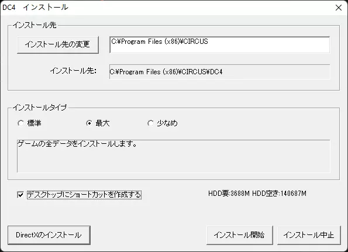

總之先使用完整安裝。安裝完之後卸載虛擬光盤，打開遊戲，會出現如下圖的提示。


我們可以插入虛擬光盤再來，或者根據 Blog Note 5 的方法破解光盤驗證。
這個部分就留給讀者們作爲練習啦。

## 三、激活碼驗證初探

過了光盤驗證之後，牠會顯示這麼一個輸入激活碼的框框。

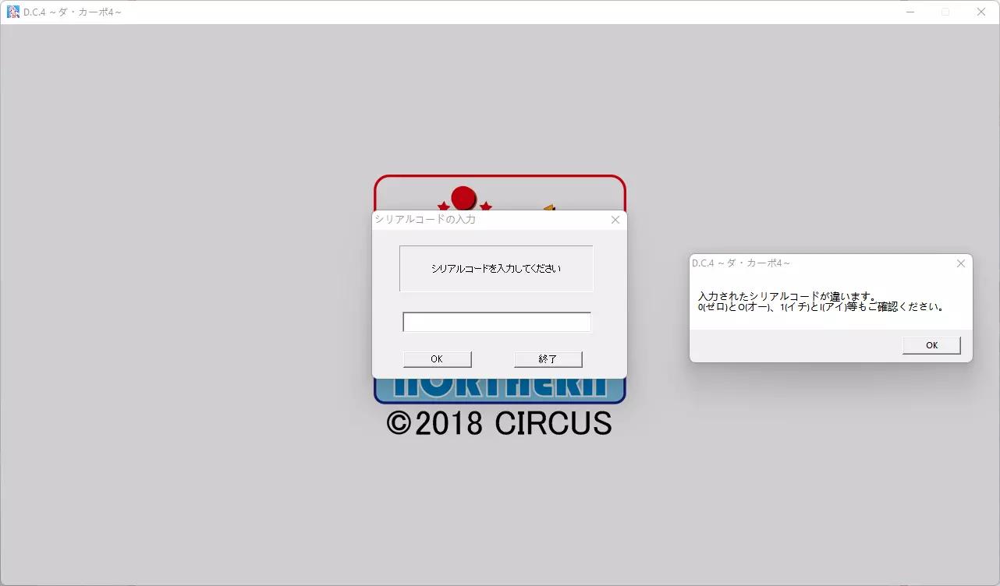

點 OK 會出現右邊那個提示激活碼錯誤的框框，點其他地方遊戲會退出。
想必已經有群友知道該怎麼破解了，直接給 **MessageBox** 下斷點，然後看看調用框框的附近是怎麼樣的。

直接掏出 x64dbg，斷點怎麼下的，怎麼返回的，我就不細說了，之前那篇文章裏有提到。
經過一番操作，我們來到了下圖的這麼一個地方。


眼尖的群友可能已經發現了，上面是一個 **CALL TEST JL** 素質三連，如果它對 **CALL 44D440** 的返回值不爽了，就會跳轉到圖中的調用 **MessageBox** 的地方。
（從圖中我們也能看到對話框中顯示的文字 作爲參數 **PUSH** 到了棧裏面）

那我們是不是反手把 **JL** 給改成 **NOP**，讓他不跳轉，是不是就可以了呢？
簡單改一下看一下：

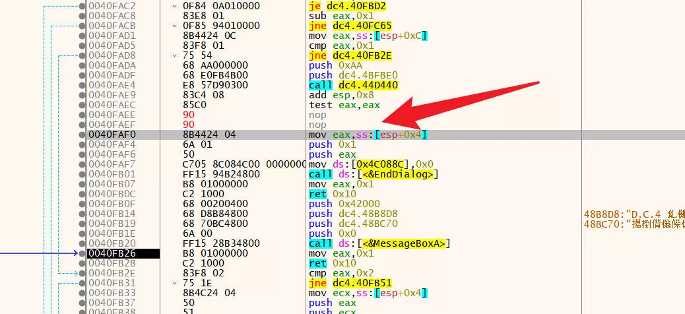

然後讓程序繼續，再去點一下那個 OK 試試看。

<video preload='auto' autoplay muted loop width="100%">
<source src="https://s3static-zone0.galgamer.eu.org/video-2d35/note-dc4crack/3-4.mp4" type="video/mp4">
</video>
<div class="text-center">圖 3-4 把 JL 消除了就無限彈窗</div>

很奇怪，雖然錯誤提示框沒再彈出來，但是我們還是沒通過驗證。
看來有必要仔細審視一下這個判定機制。

打開 IDA，來到同樣地址的地方，可以看到他的分支是這樣子的。


如圖，如果 **CALL 44D440** 返回值小於 **0**，那麼就會跳轉到右邊，修改後不跳轉了就會走左邊。
然而走左邊並沒有規避掉驗證，只是消除了對話框而已。

對着 **CALL 44D440** 點進去看看這個函數到底是幹嘛的。


粗略看了一眼（其實也不用太細看，簡單看一下整個函數的「形狀」和返回值，就能推敲大致的作用了），
發現這個函數進行了多次的判斷，如果在中途判斷失敗，則會向左邊分岔，並且返回一個負數表示出錯。
如果一直判斷通過，則會一直走右邊分支，並且在最後返回一個運算結果。

由於現在還不太清楚運算結果是什麼，不能直接亂改這個函數。

再用 IDA 看一下有哪裏調用了這個函數。

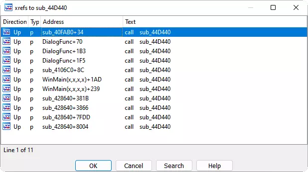

有不少的地方都調用了這個判斷函數，因此印證了之前的猜想，那就是驗證存在於多個地方，
因此之前只改掉一處的分支並不能通過這個驗證。然後我把上圖中的地方都點進去看了一下，
大多數都是一模一樣的 **CALL TEST JL** 素質三連，少部分是 **CALL TEST JGE** 素質三連，
因此我又猜測程序只對這個函數的返回值的正負做了判斷，至於運算結果什麼的不重要。

那麼給這個 **44D440** 函數起個名字吧，就叫***判定一***。
因此破解的思路就是直接把***判定一***的開頭改成：

```x86asm
MOV EAX, 正數
RET
```

隨便返回一個正數就完事了。
其實我也測試過了，這麼改真的能繞過激活碼檢查，無論輸入什麼都是正確。

所以破解完畢，全劇終。

...

## 四、僞造激活碼

天上烈日高照，在經歷了大排長龍的人群的摧殘之後，與剛從家裏出來的時候相比，你的手中多出了一個神必的黑色塑料袋。穿過繁忙的大街和無人的小巷，你不由得加快了回家的腳步，揚起的風吹拂着黑色塑料袋，在牠的表面上隱約浮現了一個立方體的形狀。

終於回到家了，家裏一個人都沒有。真是寂靜的午後啊，你心想道。爲了接下來的儀式，你走向了浴室進行沐浴更衣。然後端坐在了搭配有 RTX 4090 的電腦前，打開了今天的黑色塑料袋。

裏面是 ***D.C.4 ダ・カーポ 4***（唸作 噠咔\~頗four\~）。

然後你回想起了二十年前，同樣是一個寂靜的午後，端坐在 Windows XP 電腦前的你 把老爹花 ￥320 買的瑞星殺毒軟件的光盤塞進了電腦。在百無聊賴地等待進度條跑完之後，你面對着輸入激活碼的窗口，把瑞星殺毒軟件說明書上的激活碼打了進去。

不巧的是，電腦彈出了一個窗口**「你可能是盜版軟件的受害者，請輸入 Windows XP 激活碼。」**，可是 Windows XP 的價格不是瑞星殺毒軟件能比的，一般人家也買不起。你咬咬牙，關掉了那個窗口，心想要是自己有無限的激活碼該有多好。

就在大腦進行這些無聊的回憶的十秒間，***D.C.4 ダ・カーポ 4*** 已經安裝在了 SSD 上，並且問你要激活碼，於是就像二十年前一樣，你把說明書上的激活碼打了進去。緊接着夢醒了，電腦裏面只有從萊茵圖書館下載的 DC4，沒有什麼激活碼，更沒有什麼黑色塑料袋。

你想再次體驗到 把一串看上去毫無意義卻又獨一無二的激活碼輸進去 的那種 啊，我真的擁有這個 Galgame 啊\~  的儀式感，可惜卻已經不能實現了。

<div class="alert alert-success" role="alert">
  <span class="alert-heading" style="font-size: 125%;">🤔激活碼</span><br>
  軟件防盜版技術的一種，通過向購買的人發放獨一無二的激活碼，<br>
  再通過恰當的驗證機制來確認買家的所有權。
</div>

就算讓***判定一***始終返回 **True**，也不能讓我們體會到儀式感。難道就沒有什麼方法拿到激活碼嗎？
（其實是這篇文章就那樣全劇終就太無聊了，改 **MOV EAX, 正數** 誰不會）

很顯然，激活碼的祕密就藏在***判定一***之中，讓我們再次審視圖 3-6。


可見，***判定一***一上來就是一個循環，然後緊接一個分支，放大來看是這樣的。

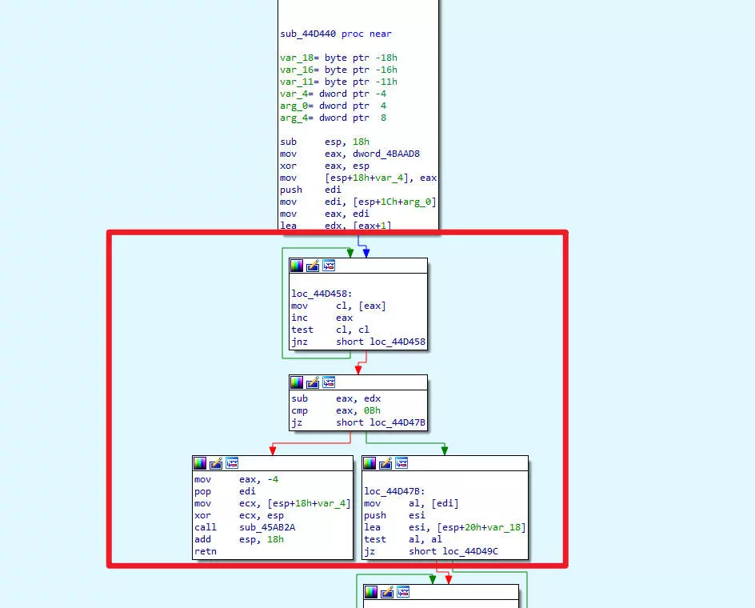

可見，這個循環幹的事情就是不停地把 **EAX** 指向的內存移動到 **CL**，然後把 **EAX** 增加一格，測試這個 **CL** 是否爲 **0x0**，如果不爲零，則繼續循環。如果遇到 **0x0**，則停止循環開始判斷。

那麼 **EAX** 從哪裏來呢？在上面可以看到 函數的第一個參數先給複製了 **EDI**，然後 **EDI** 又複製給了 **EAX**，然後順便把 **EAX** 下一格的地址給了 **EDX**。

到此我覺得應該先暫停一下，看看***判定一***的參數是什麼。先對圖 3-2 的***判定一***之前下一個斷點，然後打開遊戲隨便輸入一個激活碼，比如說我這裏輸入 My name is esuOneGov，然後 x64dbg 顯示如圖 4-3。

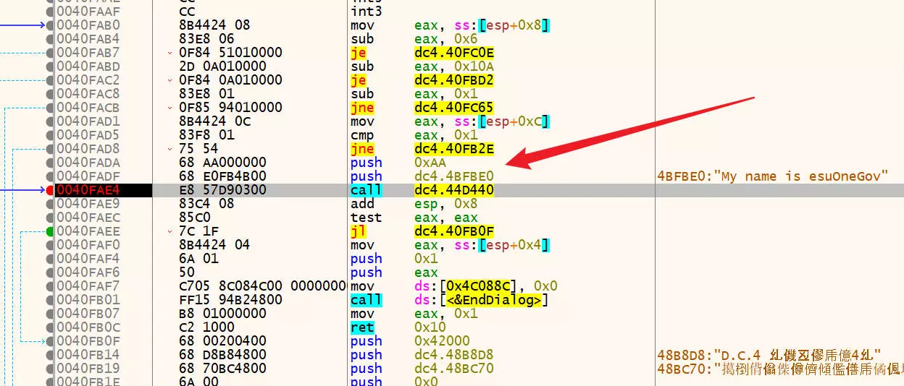

可見***判定一***吸收了兩個參數，第一個是字符串指針，指向我輸入的激活碼「My name is esuOneGov」，第二個參數是一個數字 **0xAA**，目前不知道有什麼用。

然後再回看圖 4-2 的循環，是不是已經知道是在幹嘛了？**EAX** 是我輸入的激活碼的地址，**CL** 是激活碼的其中一位，循環次數是直到 **CL** 變爲 **0x0** 爲止，是不是在求字符串長度呢？往下看有一個

```x86asm
SUB EAX, EDX
CMP EAX, 0xB
JZ  地址
```

循環結束後 **EAX** 是字符串結束地址加一，**EDX** 是字符串開始地址加一，相減以後就是字符串長度，然後如果長度等於 **11** 則跳轉。
所以我們已經知道了激活碼一定是十一位長度。

<div class="alert alert-success" role="alert">
  <span class="alert-heading" style="font-size: 125%;">🤔循環</span><br>
  遇到循環先搞清楚作用然後再跳出，特別要關注循環的次數。
</div>

過了長度判定之後又是一個循環，如圖所示：

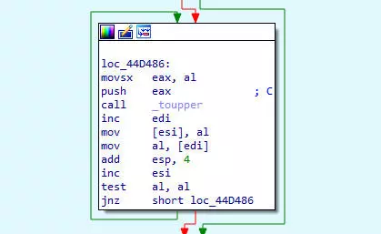

又是對激活碼進行逐字處理，並且 IDA 已經貼心地給我們標出了中間用到的函數名字 **_toupper**，那麼已經不用細看就能知道這一步是在把整個激活碼的所有字母轉換爲大寫。
所以我們已經知道激活碼一定是只有大寫字母和數字。

然後緊接這一個長運算和一個判斷，我把這個長運算叫做 **stage1**，因爲是校驗的第一階段。其中長運算裏面又調用了另外的三個函數，如圖所示：

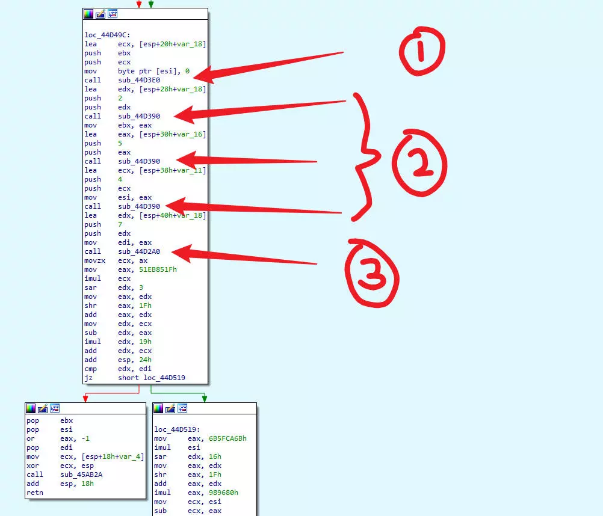

首先要搞清楚編號1️⃣的函數是在幹啥，點進去以後其實又是循環，看得有點頭大我就不貼圖了，直接點 F5 讓 IDA 幫我們反編譯成 C 語言如下：

```C
int __cdecl sub_44D3E0(const char *a1)
{
  int result;
  char v2[20];

  strcpy(v2, a1);
  for ( result = 0; result < 11; ++result )
    a1[result] = v2[dword_4B4FFC[result]];
  return result;
}
```

這樣子就很好看了，首先這個函數吸收了一個參數 **a1**，就是我們輸入的激活碼，然後又開闢了一個新字符串 **v2**，把 **a1** 複製到 **v2**，
然後用一個循環進行了 **11** 位的處理。中間那個像數組的東西 **dword_4B4FFC** 我貼出來給大家看是這樣的：

```Python
dword_4B4FFC = [0, 1, 5, 3, 0xA, 8, 7, 2, 6, 9, 4]
```

很明顯，他是在按照一定的順序重新排序 **11** 位的激活碼，其中第 **0** 位是原來的第 **0** 位，第 **1** 位是原來的第 **1** 位，第 **2** 位是原來的第 **5** 位，依此類推。所以我順手寫出一樣的 Python 代碼如下：

```Python
def change_order(target):
    order = [0, 1, 5, 3, 0xA, 8, 7, 2, 6, 9, 4]
    result = [0, 0, 0, 0, 0, 0, 0, 0, 0, 0, 0]
    for i in range(len(order)):
        result[i] = target[order[i]]

    return ''.join(result)
```

然後編號2️⃣的函數，點開裏面又是一堆循環，直接故伎重演 F5 得到代碼如下：

```C
int __cdecl sub_44D390(char *serial, int count)
{
  int result; 
  int loop_count; 

  result = 0;
  if ( count > 0 )
  {
    loop_count = count;
    do
    {
      if ( isdigit(*serial) )
        result = *serial + 36 * result - 22;
      else
        result = toupper(*serial) + 36 * result - 65;
      ++serial;
      --loop_count;
    }
    while ( loop_count );
  }
  return result;
}
```

可見2️⃣號函數吸收了兩個參數，第一個是打亂過後的激活碼，第二個是一個數字，然後最後返回了一個計算結果。大概看了一下中間，可以很快地知道這個函數的作用是 根據給定的一個字符串，和一個給定的循環次數來計算一個值。

至於爲什麼要這麼做，我覺得就是故意把激活碼的算法弄得複雜防止被人輕易解開。所以我順手寫出一樣的 Python 代碼如下：
（那個 **if count > 0** 純屬脫褲子放屁所以我省略了）

```Python
def calc_a_value(target, count):
    result = 0
    for i in range(count):
        if target[i].isdigit():
            result = ord(target[i]) + 36 * result - 22
        else:
            result = ord(target[i]) + 36 * result - 65
    return result
```

然後是編號爲3️⃣的函數，點進去一看我傻了。

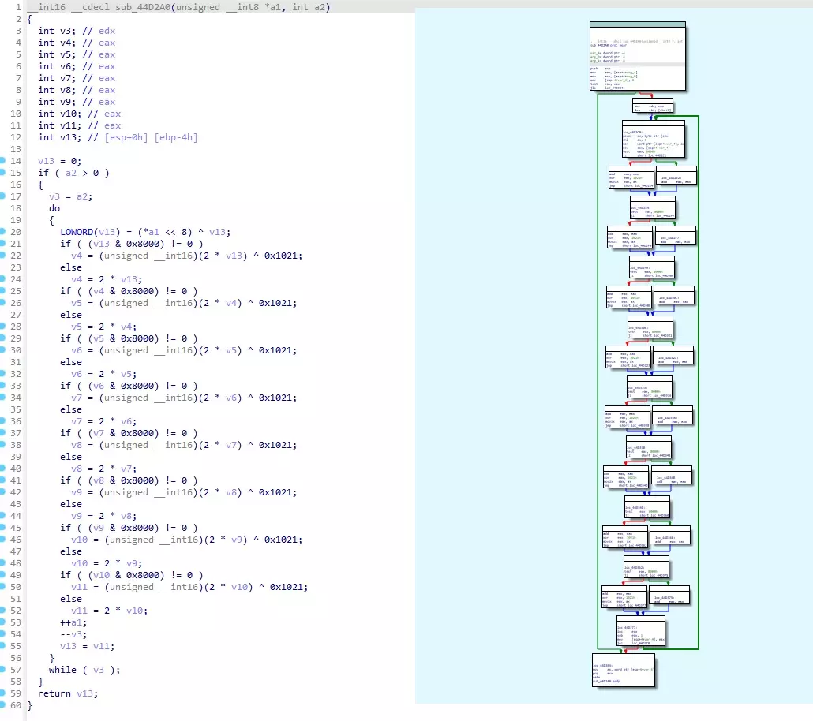

首先牠吸收了兩個參數，第一個是打亂過後的激活碼，第二個是一個數字 **count**，然後最後返回了一個計算結果。大概看了一下中間，是一個大循環，然後對着 **EAX** 做了一個奇怪的操作 **8** 次。俺還在尋思爲什麼牠不寫成循環，可能只是爲了噁心沒事跑去逆向的人？

首先我隨手就寫出了進行奇怪操作一次的 Python 代碼：
(**&** 上一個 **ffff** 是爲了讓他保持 **16** 位的長度)

```Python
def strange_op(eax):
    if (eax & 0x8000) == 0:
        eax += eax
        eax &= 0xffff 
    else:
        eax += eax
        eax &= 0xffff 
        eax ^= 0x1021
        eax &= 0xffff
    return eax
```

然後這個八次奇怪操作放到大循環裏面執行 **count** 次，隨手寫出 Python 代碼如下：

```Python
def sub_44D2A0(moved_serial, count):
    result = 0  # WORD 16 bit
    for ecx in range(count):
        ax = ord(moved_serial[ecx]) & 0xffff
        ax = (ax << 8) & 0xffff
        result = (result ^ ax) & 0xffff

        eax = result
        for _ in range(8):
            eax = data_strange_op[eax]
        result = eax

    return result & 0xffff
```

其實這些代碼對人類沒什麼意義，只是在用儘可能複雜的方式來校驗激活碼（並且噁心沒事去破解的人）

弄懂這些被調用的函數以後，我們再次審視圖 4-5 的 **stage1** 的流程圖。
光用肉眼看還是不太知道是在幹嘛，然後我就用調試器跟蹤了一遍，知道了牠在分段處理激活碼，如圖。

假設我輸入的激活碼是 **ABCDEFGHIJK**:

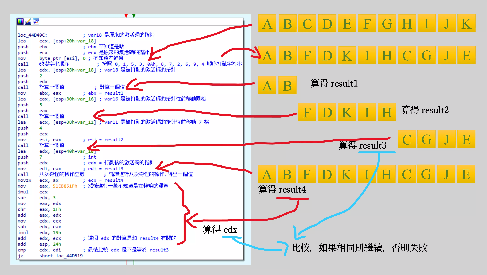

在這一步會計算出五個結果，分別是 **result 1** 到 **4** 和一個 **EDX**，其中 **EDX** 由 **result4** 計算而來，和 **result3** 對比相同則允許進入下一步。

然後隨手寫出 **stage1** 對應的 Python 代碼：

```Python
moved_serial = change_order(serial)

result1 = calc_a_value(moved_serial[0:2], 2)  
result2 = calc_a_value(moved_serial[2:7], 5)
result3 = calc_a_value(moved_serial[7:11], 4)
result4 = sub_44D2A0(moved_serial, 7)

multiple = result4 * 0x51eb851f
edx = ((multiple >> 32) & 0xffffffff) >> 3
eax = edx + (edx >> 31)
edx = result4 - eax
edx = (edx * 0x19) & 0xffffffff
edx += result4

if edx != result3:
    return
else:
    pass
```

簡單看一下這個 **stage1** 的驗證，其中 **result3** 對激活碼的後 **4** 位進行了計算，**result4** 對激活碼的前 **7** 位進行了計算，總而言之就是整個激活碼都參與了計算。如果我們要僞造一個能通過 **stage1** 的激活碼，那就必須像無頭蒼蠅一樣窮舉 **11** 位，可能性是 36^11.

接下來是 stage2 的驗證，如圖：

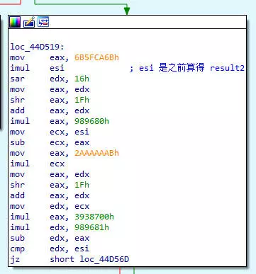

**stage2** 看起來簡單得多，就是一些毫無意義的加法減法乘法移位隨便運算一下，因此隨手寫出一樣的 Python 代碼如下：

```Python
result2 = calc_a_value(moved_serial[2:7], 5)  # esi

multiple = result2 * 0x6B5FCA6B
edx = ((multiple >> 32) & 0xffffffff) >> 0x16
eax = edx + (edx >> 31)
eax = (eax * 0x989680) & 0xffffffff
ecx = result2 - eax

multiple = 0x2aaaaaab * ecx
edx = ((multiple >> 32) & 0xffffffff)
eax = edx + (edx >> 31)
edx = ecx
eax = (eax * 0x3938700) & 0xffffffff
edx = (edx * 0x989681) & 0xffffffff
edx = edx - eax

if edx == result2:
    通過！
```

簡單看一下這個 **stage2** 的驗證，其中 **result2** 對激活碼的中間五位進行了計算，接下來就是對 **result2** 變來變去而已，如果我們要僞造一個能通過 **stage2** 的激活碼，那就必須像無頭蒼蠅一樣窮舉 **5** 位，可能性是 36^5，比剛才的 36^11 小了超級多，已經是普通電腦可以窮舉的運算量。

最後再來看一下 stage3 是怎樣的。

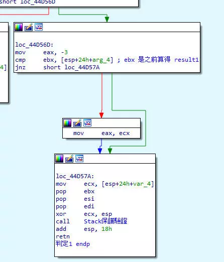

這邊代碼就更少了，只是對 **result1** 進行了判斷，只要 **result1** 等於 **arg4**，就會返回一個 **ECX**，否則就會返回一個 **-3**，而負數返回表示失敗。**ECX** 是一個中間運算結果，具體是什麼我也不太清楚，但是可以猜測是一個正數。

然後 **arg4** 就是之前提到的傳給 ***判定一*** 的第二個參數，他是 **0xAA**，而 **result1** 對激活碼的前兩位進行了計算。如果我們要僞造一個能通過 **stage3** 的激活碼，那就必須像無頭蒼蠅一樣窮舉 **2** 位，可能性是 36^2 = 1296 種。

這個可能性那麼少，不直接窮舉一下能忍？然後我就簡單窮舉了一下，發現能通過 **stage3** 的激活碼前兩位只有一種組合，**E0**。
因此我們已經可以確定所有激活碼都是 **E0** 開頭。

## 五、無頭蒼蠅式激活碼盲狙器

之前我們已經知道激活碼前兩位必定是 **E0**，那之後我們只需要窮舉 **9** 位，總共有 36^9 = 1,015,599 億 種可能性，好吧看起來還是相當地多。

然後我寫了一個 Python 小程序，功能就是隨機生成九位的激活碼然後放進去計算，看看符不符合要求，如果符合則 **print** 出來，就如同無頭蒼蠅亂撞一般。當然我已經做了必要的優化來提高運算速度，最後進行測試的時候，一個 CPU 跑 1,000,000 次計算需要六秒鐘。。。

好吧，我承認這個數據看起來很令人絕望，但是我們還不知道所有有效的激活碼到底有多少種組合，和 1,015,599 億比起來是多還是少，如果多的話，碰運氣說不定真能碰到呢？

那是星期日的晚上八點，我把我精心製作的無頭蒼蠅搜索器打開，然後出門去吃麥當勞。回來的時候，居然真的有激活碼被無頭蒼蠅撞了出來，數量可能達到了二十多個（我沒細數）填進遊戲裏面當然是能用的，於是我們第一次成功拿到了 DC4 的有效激活碼。

順帶一提，DC4 所有激活碼的組合數量是接近一千萬個，大約佔九位窮舉可能性的一千萬分之一，也就是平均猜測一千萬次就會猜中一次，對於電腦來說就是一分多鍾的時間，之後我對盲狙器的代碼進行了修改，讓他能支持多核 CPU 同時跑，大大加快了盲狙速度。

對盲狙器代碼有興趣的群友可以在這裏下載，我已經加上了適當的註釋。

https://github.com/Yamabuki-bakery/reverse-DC4/blob/master/reverseDC4.py

## 六、徹底窮舉！尋找 DC4 所有的激活碼

我時常在想，軟件公司是怎麼設計激活碼算法的呢？既要讓驗證一串文字正不正確非常簡單，又要讓倒推可能的激活碼非常困難，那麼遊戲公司是如何找到激活碼的呢？難道跟我一樣是盲狙法嗎？？

在前文的分析中已經看到，一串文字要分別通過 **stage1**，**stage2** 和 **stage3** 的測試才能被判定是完整的激活碼。
其中 **stage1** 是 **11** 位都參與了運算，窮舉起來根本不可能，而 **stage2** 是五位，有六千萬種可能性，**stage3** 就很簡單了，只要固定開頭是 **E0** 就行了。

因此我有一個靈感，先窮舉相對簡單的 **stage2**，找出所有符合要求的中間五位數，也就是 **serial[2:7]** 。我也確實對這五位數進行了窮舉，符合要求的有九百多萬個。
然後再對於每一個 **[2:7]** 加上頭部的 **E0**，對尾部的 **[7:11]** 四位數進行 **stage1** 窮舉。因此計算量爲 九百萬 * 32^4 = 94372 億。這個數字還是非常龐大，首先我沒有一秒鐘能算一億次的電腦，我也沒有時間跑那麼久（這篇文章星期六就要發呢，，，）所以要尋找別的方法。

我再次審視 **stage1** 的代碼，其中 **result1** 和 **result2** 無關緊要我就省掉了。

```Python
moved_serial = change_order(serial)

result3 = calc_a_value(moved_serial[7:11], 4)

result4 = sub_44D2A0(moved_serial, 7)
multiple = result4 * 0x51eb851f
edx = ((multiple >> 32) & 0xffffffff) >> 3
eax = edx + (edx >> 31)
edx = result4 - eax
edx = (edx * 0x19) & 0xffffffff
edx += result4

if edx != result3:
    return
else:
    pass
```

運算量主要集中在兩個地方，首先是 **result3**，對末尾四位進行了計算。爲了加快運算速度，我又寫了一個程序來窮舉 36^4 種可能性，並且記錄牠們的 **result3** 結果，記錄在一張表裏面，這樣我們就可以通過 **result3** 來反查對應符合要求的 末尾四位，讓 32^4 次運算直接變成了一次查表操作。

然後是 **result4** 到下面亂七八糟那坨，對前七位進行了計算，由於頭兩位是 **E0**，所以實際上是五位。首先是那個醜陋的 **sub_44D2A0**，不知道你們還記得嗎，裏面有那個該死的對 **EAX** 的八次奇怪操作。**EAX** 的長度是 **32** 位，如果要製作一張表窮盡所有 **EAX** 並記錄八次奇怪運算的運算結果，那麼就需要計算 43 億次...而且我電腦也沒有那麼多內存來放這張表。

但是好消息是，奇怪操作的運算結果似乎只有低 **16** 位在參與，因此我們可以窮盡所有 2^16 = 65536 種 **EAX** 組合，製成一張表，當我們在需要進行八次奇怪操作的時候直接查表，免去 7 * 8 = 56 次運算。然後我發現我的電腦內存時候可以塞下 36^5 = 六千多萬 項的表，於是我又窮盡了所有 中間五位 **[2:7]** 的可能性，分別計算了他們的 **result4** 和 **edx**，並記錄下來。

最後，我的窮舉算法變成了這樣：

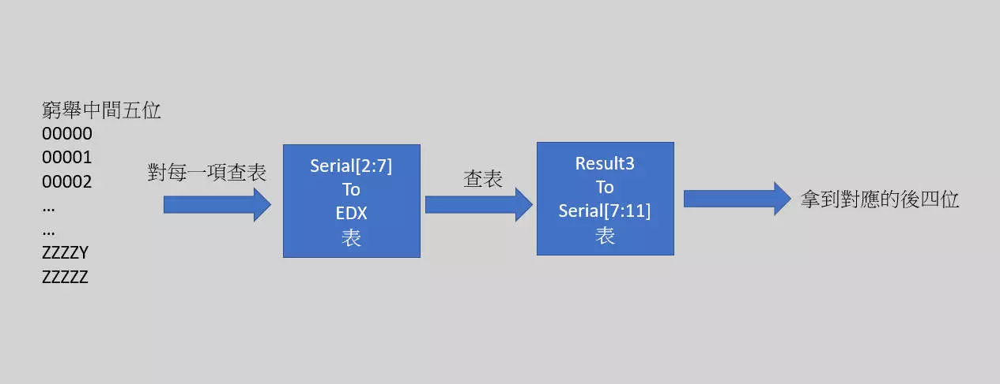

花費的時間主要在製作那兩張表上，因爲要進行上千萬次的運算，需要幾分鐘才能跑完。然而，當真正進入到生成激活碼的環節時，由於省略了上千億次的運算，只需要進行查表操作，速度非常快，幾十秒就可以計算完畢，最後得到的結果是：

**DC4 有效激活碼個數 9,930,143 個** 

這個窮舉程序也放出來了，有興趣的群友可以下載，Python 直接運行，給牠五分鐘，牠就會把所有的激活碼保存在一個數據庫文件中給你。

https://github.com/Yamabuki-bakery/reverse-DC4/blob/master/DC4generator.py

## 七、不破解也是一種破解方法

正片到這裏就結束了。我們把得到的激活碼輸進遊戲裏面，就可以成功通過驗證了......

......然後我們就來到了如下圖的界面：


遊戲會問你是否需要免光盤啓動，點擊是的話就會來到如下圖的界面。

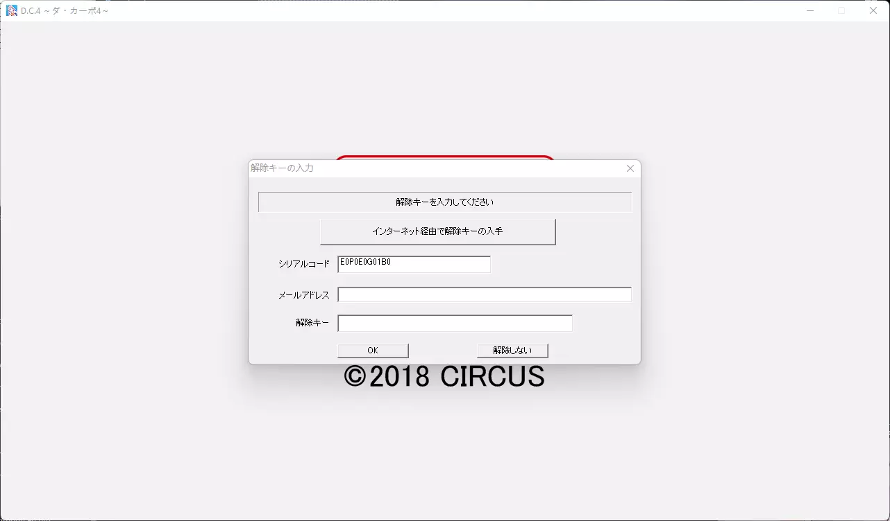

有三個輸入框，第一個是輸入激活碼，第二個是輸入你的郵箱，第三個是輸入一個叫做解鎖 key 的東西。至於解鎖 key 怎麼得，那就要點上面的按鈕進入遊戲官網，向官方登記你的激活碼和電郵地址，官方就會下發一個解鎖 key，填進去以後遊戲就再也不會問你要光盤或者密碼什麼的了....

但是那個官方頁面 404 了，很顯然是不再提供服務了...

值得一提的是，這個輸入解鎖 key 的界面，要是最頂上的激活碼輸入不正確（不能通過***判定一***），則下面的 OK 鍵會變成灰色，按不下去，，，


出於好奇心，我適當地隨便填了幾個值，然後通過 **MessageBox** 斷點找到了判定這個解鎖 key 的地方，如圖所示：

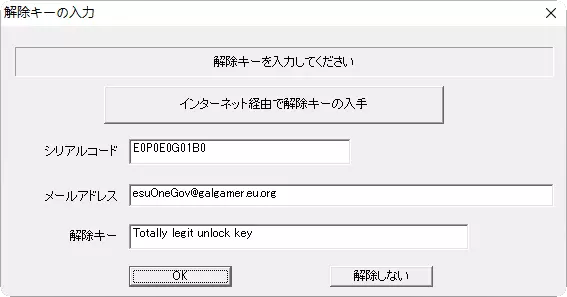


可見，判定這個解鎖 key 的函數（姑且叫***判定二***）也是一個 **CALL TEST JE** 素質三連，因此故伎重演把它開頭改成返回正數就能輕鬆破解，，，

但是如果我們在這裏點取消的話呢？

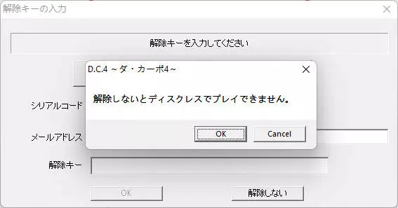

他會告訴我們不解鎖就沒法免光盤玩...

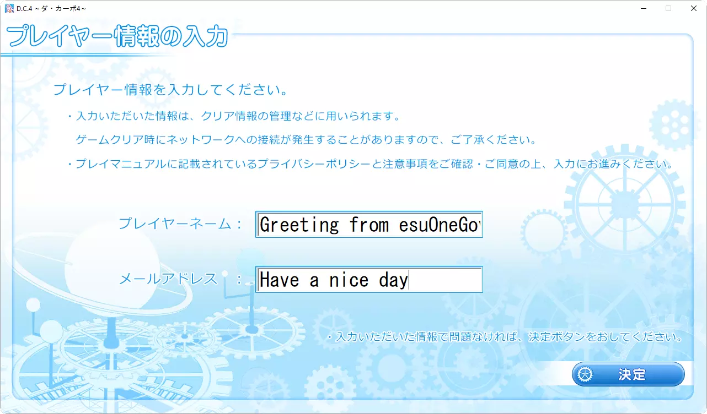

就直接進入了遊戲...根本不需要破解。
其實本章想傳達給讀者的是，不破解其實也是一種破解方法，找找官方留下的空子（有些甚至寫在說明書裏面）後門，說不定有意外的驚喜呢？

最後，讓我們來看看這個遊戲所謂的免光盤啓動到底是什麼東西，打開遊戲的註冊表項一看：

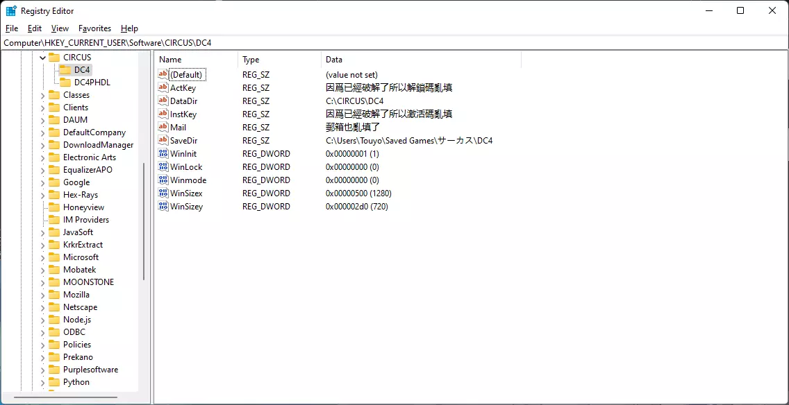

原來遊戲把我們輸入過的東西都記錄在註冊表裏面，當遊戲啓動時，如果這些記錄的值能同時通過***判定一***和***判定二***，則什麼都不需要填就能進入遊戲了。

## 八、總結

本文已經很長了，再總結就成論文了，我就不多比比了。總之這遊戲的所有激活碼都給我找出來了，至於免光盤解鎖碼？留給讀者作爲練習啦。
 
## 課後練習

爲了和群友們共同進步，交流經驗，我在這留下一些輕鬆有趣的練習。

  1. 破解第二章所提到的光盤驗證。


  2. 利用第三章末尾所說的修改正數返回值的方法破解激活碼驗證。

```
MOV EAX, 正數
RET
```

  3. 安裝遊戲，從遊戲附帶的說明書 PDF 中找到讓輸入免光盤解鎖 key 的對話框不彈出的方法。

  4. 利用修改正數返回值的方法破解免光盤解鎖 key 驗證。


  5. 破解免光盤解鎖 key 的生成算法，並撰寫文章發表到迫真頂級期刊《Galgame 頻道》。


## CG 欣賞

本站姑且還是個 Galgame 網站，隨便放幾張 CG 來湊數吧。


## 資源和下載

這裏的資源包含有 DC4 的四部曲，其中第一部，即 ***[190531] [CIRCUS] D.C.4 ～ダ・カーポ4～ 初回限定版 + Original Soundtrack + Bonus + Manual*** 就是本文的素材。



<style>
body {
    background: var(--bg-url) no-repeat fixed center;
    background-size: cover;
    /*-webkit-font-smoothing: unset;*/
}
#banner {
    background: url('')!important;
    background-color: transparent!important;
}
#toc {
     background-color: var(--board-bg-color);
     padding: 20px 10px 20px 20px;
     border-radius: 10px;
}
#board {
    backdrop-filter: blur(5px);
    -webkit-backdrop-filter: blur(5px);
   /* background-color: #3337 !important;*/
}
.full-bg-img > .mask {
  background-color: rgba(0,0,0,0) !important;
}
.page-header  {
  background-color: rgba(0,0,0,0.5);
  padding: 3px;
  border-radius: 5px;
}
:root {
  --board-bg-color: rgba(255,255,255,0.7);
  --bg-url: url('../image/note-dc4crack/bg.webp')
}
[data-user-color-scheme='dark'] {
  --board-bg-color: rgba(0,0,0,0.85);
  --bg-url: url('../image/note-dc4crack/bg.webp')
}
::selection {
    /*background-color: #f00;*/
}
.page-header .mt-1 span.post-meta {
    /* 隱藏嚇人的字數統計 */
    display: none;
}
</style>