`作者：Hikari Field 棺方頻道`

## At A Glance

每天的逆向工程水平提高一點點...每天？每年！
今年我們來嘗試破解 SiglusEngine 的光盤驗證。

本文同樣是拿 ***銀色、遙遠*** 開刀，所以圖片也懶得找了，直接用 Blog Note 3 的。
感謝 BAHAROA 讓我抄襲圖片，，，

| 資訊一覽     |                 |
| :----------- | :------------------------------------ |
| **開發商**   | tone work's           |
| **遊戲時長** | 這重要嗎？我們是來破解遊戲的                     |
| **難度**     | 中（直接選人）    |
| **遊戲引擎** | SiglusEngine      |

註：如果你第一次觀看破解遊戲的文章，我建議可以先去閱讀之前發過的
[🔗Blog Note 3：萌新的第一次 Galgame 破解](/article/20004)
那篇文章是破解 SiglusEngine 的日本地區驗證，用語詼諧幽默，易於理解，解釋了一些破解時候使用的核心概念，
如果你覺得這篇文章像謎語，可以先去看看上面這篇。
如果你覺得這篇文章太弱智，請直接教我怎麼破解更高級的驗證。

本文是破解 SiglusEngine 的光盤驗證，我覺得會成爲一坨屎山，
我儘量寫好，，，

## 寫在前面

tone work's 的大長篇，到底好不好玩嘛，我覺得算是好玩的，就是你媽太長了。
銀色遙遠 這款遊戲很久之前就以非常美麗的畫風吸引了我，

只是，時到如今，幾年過去了，我還是只打通了一條線，，，

然後昨天準備翻出來重溫一下的時候，居然被光盤驗證擋住了。

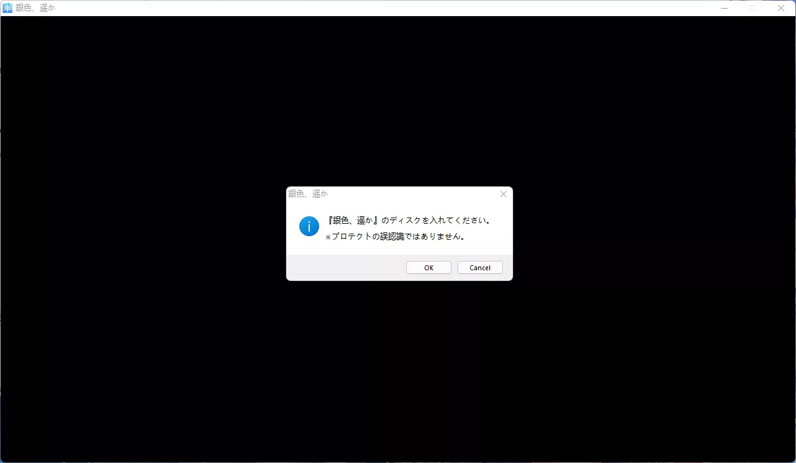

我記得這遊戲是沒有光盤驗證的啊，應該是通過地區驗證就能玩了，通過地區驗證的方法在這篇文章裏。
[🔗Blog Note 3：萌新的第一次 Galgame 破解](/article/20004)
不廢話了我們直接來破解吧，，，

## 準備工作

所需的東西：

 * IDA Pro 7.6（全泰國最強的 exe 靜態分析工具，牠到底牛逼在哪裏之後會細說）點此下載：
 * x64dbg （調試器，動態分析 exe 會用到）點此下載：[🔗前往官網](https://x64dbg.com/)
 * 已經破解過地區驗證的 銀色遙遠主程序
 

  🤔靜態分析和動態分析 
  拿到一個 exe 就像拿到一個黑盒子，不知道裏面有甚麼，是怎麼工作的。 
  靜態分析是嘗試解剖黑盒子，看看裏面都是些啥； 
  動態分析是直接運行那個程序，看看會發生甚麼。

IDA 和 x64dbg 的介面大概都長這樣：

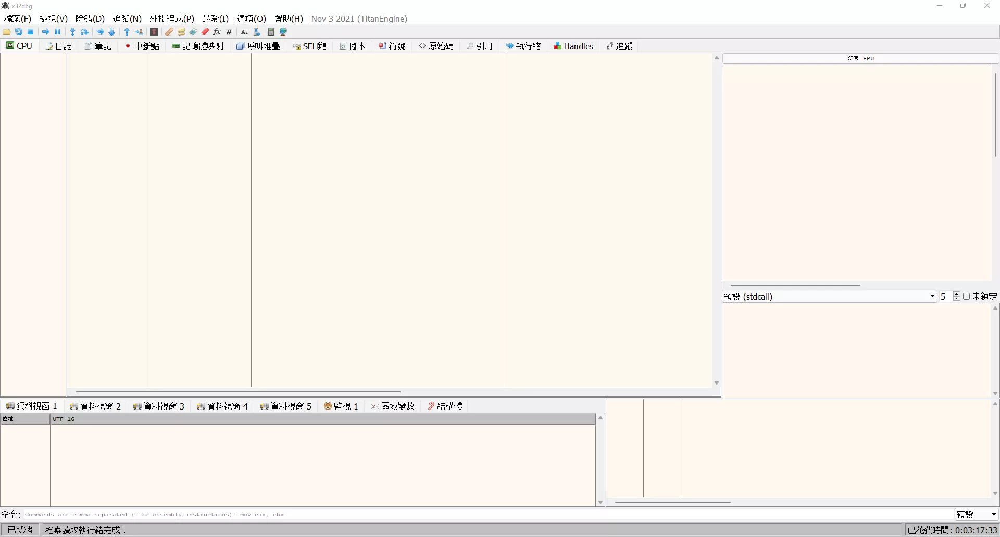

左上角那個最大的區域是觀察彙編代碼的地方。

## 開始破解

由於這個 Galgame 是 32 位程序，我們打開 x32dbg。

然後把 exe 拖進去（這裏是已經破解過地區驗證的 exe，名叫 SiglusEngine-nojapan.exe），會顯示下圖。

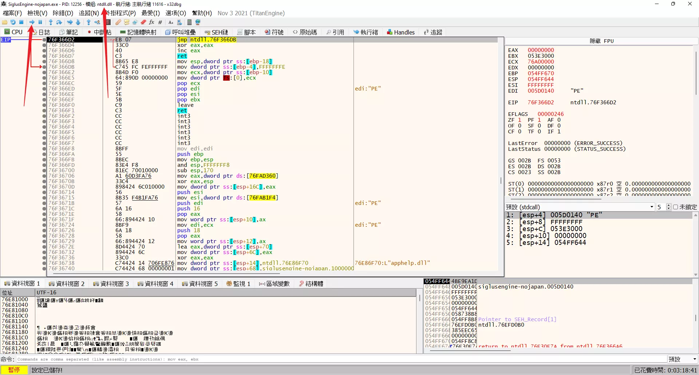

會發現現在 EIP 停在了程序最開始的地方，最頂上顯示了當前正在運行的模組是 ntdll.dll，這表示程序運行還沒真正進入到 Galgame 主程序的領空。

  🤔EIP 
  指令指針，牠會指向當前電腦 CPU 正準備要運行的那一條指令。

  🤔領空 
  電腦裏面的程序在運行的時候 不僅會運行自己的代碼，還可能會調用別的程序的代碼 來幫忙完成工作。 
  當調用別的程序的時候，EIP 會指向別的程序的代碼，我們就稱爲 現在進入了別的程序的領空。

點一下藍色箭頭，讓程序繼續運行，這時候發現已經進入了 Galgame 主程序的領空。

接下來應該怎麼辦呢？我們應該根據程序的功能來推測程序會幹些甚麼事情。
我們已經知道，遊戲在啓動時會尋找遊戲光盤，然後進行某種驗證，來決定是否進入遊戲。

所以，我猜測遊戲內部會這麼實現：

  1. 列出電腦上所有的盤
  2. 是光盤嗎？是的話就進行某種驗證
  3. 不是的話就檢查下一個盤。
    
然後直接上谷歌嗯搜：

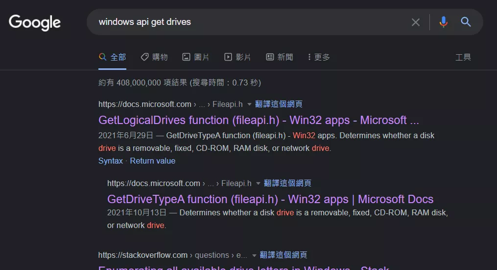

得到了兩條結果，分別是 GetLogicalDrives 和 GetDriveType。

  🤔Windows API 
  有一些敏感操作，比如說列出所有的盤或者調查所有的文件，出於安全原因，不可以由程序直接操作（要不然病毒甚麼的就能直接幹翻你的系統）， 
  此時就需要進行「系統調用」，讓 Windows 來幫你完成這個工作，告訴你結果。 
  也稱爲「調用 Windows API」。

現在要檢查 Galgame 到底有沒有使用這兩個 API。

進入「符號」頁面，左上角選遊戲主程序，右邊就會列出遊戲中所用到的 API，
這個表稱爲「導入表」，表示程序從系統中導入了這些函數以供利用。

在搜索框中搜索 GetLogicalDrives：

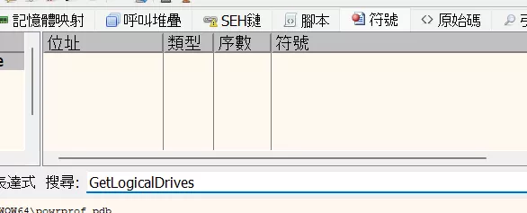

沒有，再搜索 GetDriveType：

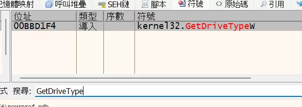

這下有了，雙擊牠點進去，會發現來到 kernel32.dll 的領空：

可以看到這裏是一個跳轉，雙擊牠查看牠跳到哪裏：

我們發現這裏是 kernelbase 的地盤，然後在函數最開始的地方下一個斷點。
如果 Galgame 確實調用了 GetDriveType 的話，那麼在進行光盤驗證的時候將會自動暫停在紅色的地方。

多次點擊藍色的繼續運行鍵，看看會發生什麼事情。

<video controls preload="metadata" width='100%'>
  <source src="https://s3static-zone0.galgamer.eu.org/video-2d35/note-sigluscrack2/1.mp4" type="video/mp4" >

 To view this video please enable JavaScript

</video>

可以看到，這個斷點被命中好多次，而且每命中一次，右邊的參數就會改變，牠從 A:\\\\ 改變到 Z:\\\\，最後遊戲彈出了警告框。

因此我們可以作出合理推斷，遊戲對電腦上的每一個盤都進行了某種判斷，如果沒有發現符合要求的盤，則會報錯。

接下來要尋找遊戲中到底在哪裏調用了 GetDriveType。。。

再進行上面錄像的操作，然後在中途停下來，如圖：

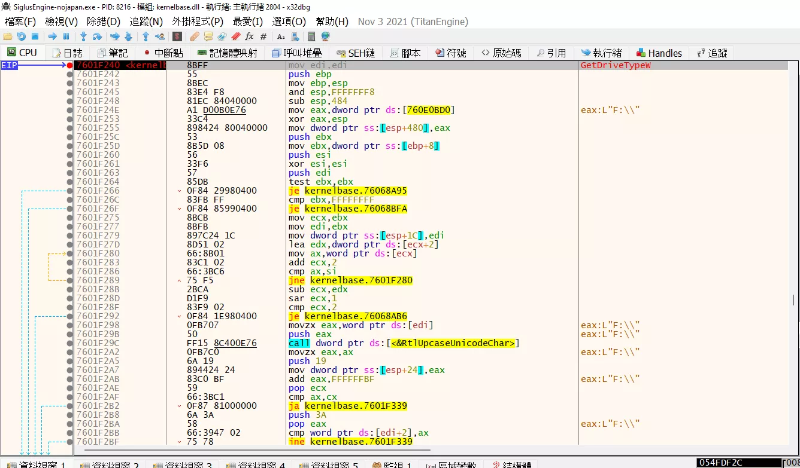

然後選擇「執行到返回」，此時 EIP 會停在一個 return 上面，再按 F7 執行一條指令：

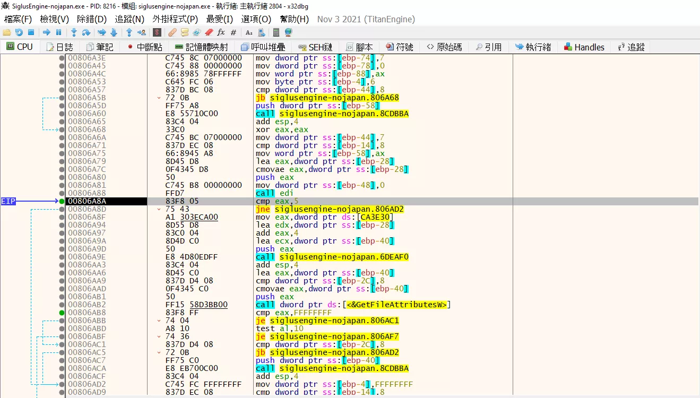

這時 EIP 返回到了遊戲主程序的領空，並且上面那一條 call edi 就是呼叫了 GetDriveType。
記住這裏的地址，他是 00806A8A。

接下來應該怎麼辦呢？面對複雜的彙編代碼，是不是覺得無從下手？
回想你遊玩 Galgame 的經歷，女主角會傲嬌，會做妖，讓人琢磨不透，
光從一句臺詞就判斷劇情的走向，似乎不太可能。

這時候我們就應該打開路線圖，，，
（是不是有股柚子味，怎麼回事呢）

打開 IDA Pro，然後把遊戲的 exe 拖進去，稍等一下，IDA 會自動分析代碼。
分析完成後顯示如圖：

我們剛才記下了調用 GetDriveType 代碼的地址，現在是不是應該先跳轉過去看看呢？

確實應該，但是不是完全應該，我們還需要知道 Galgame 在運行時候的基地址。

  🤔基地址 
  當你用 IDA 打開一個 exe，第一條指令的地址會是甚麼呢？是從 0 開始嗎？ 
  其實不是，exe 內部指明了第一條指令的地址，IDA 會尊重那個地址，並且顯示給你看。 
  但是用 x64dbg 進行動態分析的時候，第一條指令的地址是由 Windows 分配， 
  會和 IDA 中的顯示不一樣。 
  因此同一條指令在 IDA 和 x64dbg 中會出現在不一樣的位置。

回到 x64dbg 中，點記憶體映射，然後在最上面可以看到，

Windows 給這個程序的基地址是 5D0000.

我們要把這項信息告訴 IDA，以便讓兩邊顯示相同的地址。

點 rebase，

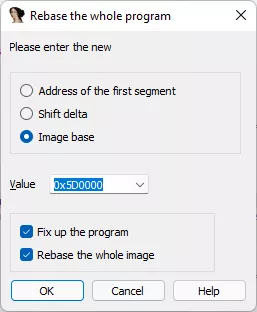

然後這時候再按 G 鍵，跳到 00806A8A，就可以完美找到剛才說的代碼了。

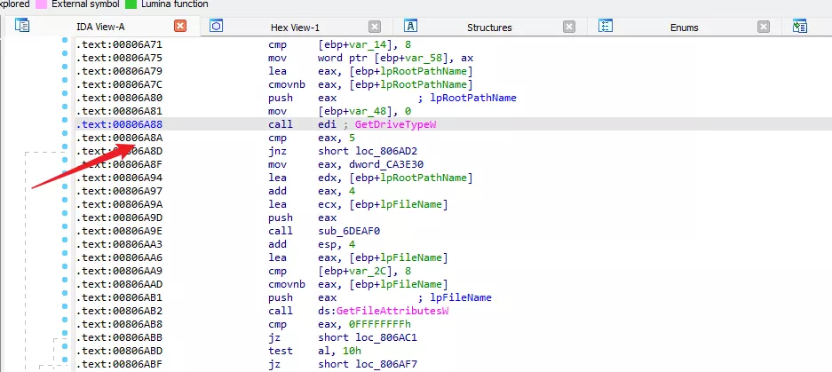

右鍵，點 Graph view，進入路線圖模式。

可以看到，在進行 GetDriveType 之後，根據結果不同程序分爲兩條路，
如果返回值不等於 5，則會走綠色那條路，如果等於 5，則會走紅色那條路。

查了一下微軟的文檔，我們瞭解到如果返回值是 5，那麼表示這個盤是一個光盤，
這也就理解了爲甚麼遊戲會在發現這個盤不是光盤的時候，就直接跳過。

然後這個光盤判斷函數的路線圖在此：

我們發現，這裏只是判斷光盤，並沒有判決遊戲能不能繼續進行的關鍵代碼，
說明關鍵代碼在外層函數，也就是這個函數返回后，由外層函數進行判斷。

接下來要找到外層函數，其實方法很簡單，回到 x64dbg，直接看調用堆棧就行了。

  🤔調用堆棧 
  程序裏面一個函數調用另一個，然後再調用另一個... 
  就這麼瘋狂套娃，但是如果函數要返回的時候，如何知道相應的外層函數是甚麼呢？ 
  以及從哪裏中斷，又該從哪裏重新開始呢？ 
  調用堆棧記錄了這些信息，我們只需要觀察堆棧，就可以找到是誰調用了誰。

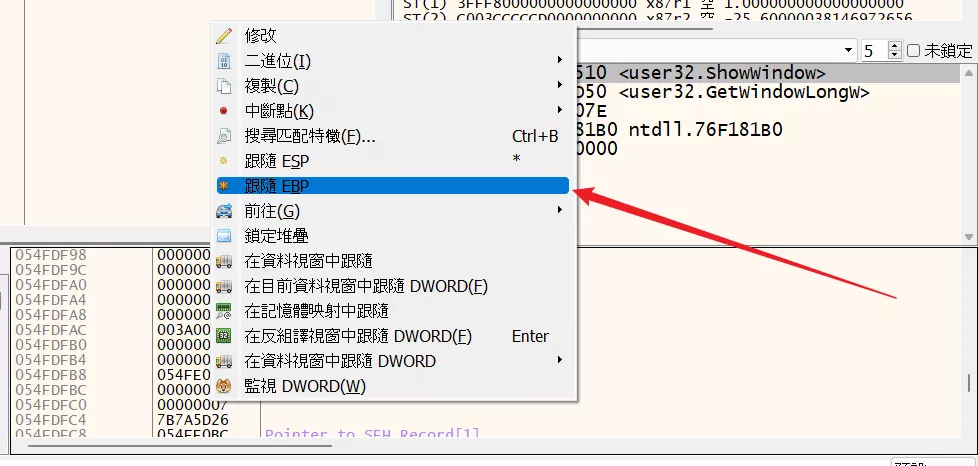

在堆棧窗口右鍵，然後跟隨 EBP（棧幀指針），可以看到目前堆棧的情況。

觀察發現，一個叫做 7C4504 的地方調用了這個光盤驗證函數。
在 IDA 打開這個地址。

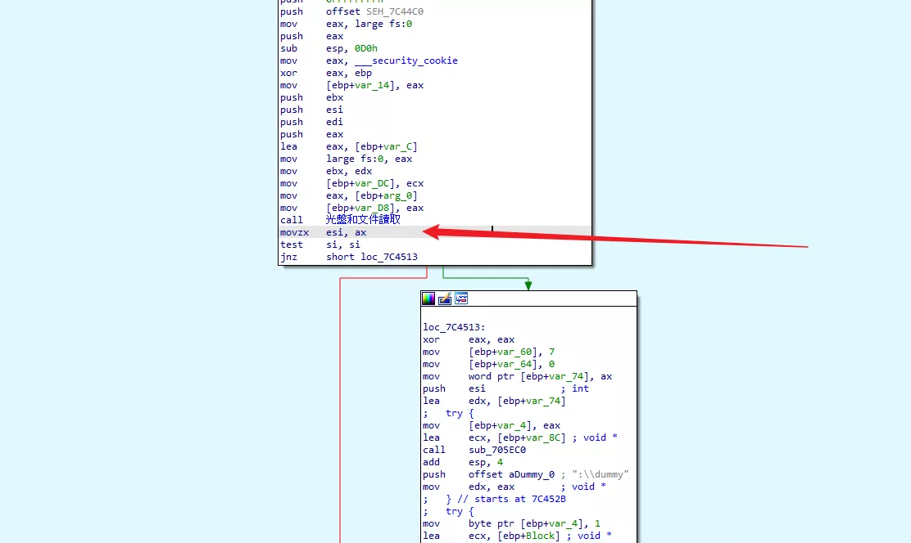

可以看到一個 call 緊接一個 test，必定是對剛才返回的光盤盤符進行判斷。
整個流程在這裏。

可以看到，程序在上面的光盤判斷后立刻分爲兩路，左邊一路直接到最底下，右邊一路又是各種判斷。
粗略觀察右邊，可以看到 dummy 的字樣，我就叫這個函數叫做 dummy 判斷函數吧。

在流程圖的最底下，我們發現：

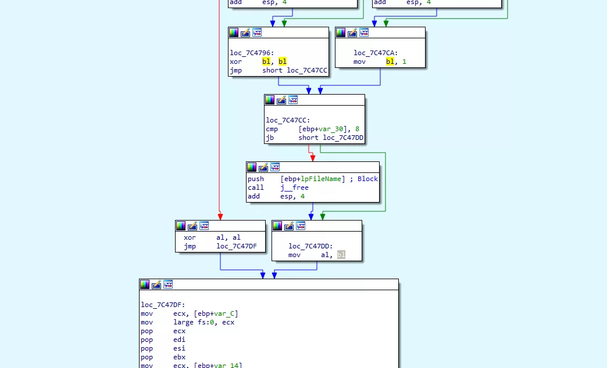

左邊那條紅線下來就是一個 xor al, al 將返回值清零，因此我推斷如果光盤驗證返回了 0 值，代表系統中沒有光盤，則 dummy 測試會直接跳過，然後返回一個失敗。

而右邊是電腦中存在光盤的情況，我們發現這裏又分兩種情況，
一種是左邊的 xor bl, bl 將 bx 清零，猜測是 dummy 測試失敗，
而另一種是右邊的 mov bl, 1 將 bx 設爲 1，猜測是 dummy 測試通過，

最後下面將 bl 移動到 al，作爲返回值。

我們又可以再合理推斷，有一個外層函數接收了 dummy 測試的返回值，如果是 0 則失敗，是 1 則成功。

在光盤驗證返回的地方下一個斷點，然程序停在 dummy 判斷的函數，然後觀察堆棧。

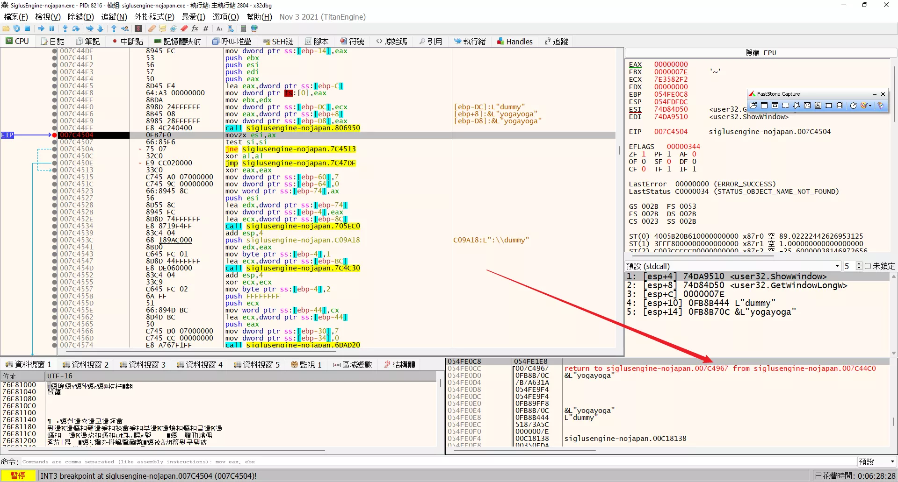

發現 dummy 測試完成后會返回 7C4967，在 IDA 打開這個地址。

這裏明顯對 dummy 測試的結果進行了判斷，如果爲 1 則走左邊，爲 0 則走右邊。

拉到下面，他的結構是這樣子的：

已經非常明顯了，失敗就會不停彈窗，成功就不會，我們只需要讓牠走左邊就行了。

回到上面，我們發現牠判斷了 bl，如果 bl 不等於 0，則走左邊。
而設置 bl 的地方在上面可以看到，mov bl, al。

那我們直接給 bl 塞一個非零值就差不多完事了，
接下來要把 mov bl, al 改成 mov bl, 1 直接塞個 1 進去。

IDA 選定那一行，點彙編，輸入我想要的指令：

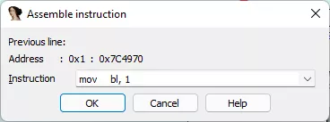

  🤔改變指令 
  不同的指令具有不同的長度，不可以把長的指令塞到短的空間裏面去。 
  幸好這邊修改的指令前後的大小相同。

最後把改變的地方保存成 exe，然後打開測試。

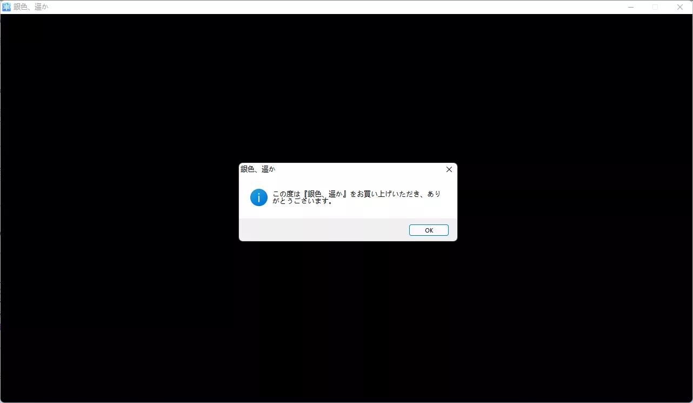

  😫哼、哼、哈啊啊啊啊啊 
  今晚是時候來一場量子波動速通辣！

## CG 欣賞

來都來了，來看一下銀色、遙遠的 CG 🎱！

## 資源與下載

我怎麼記得我以前發過？
