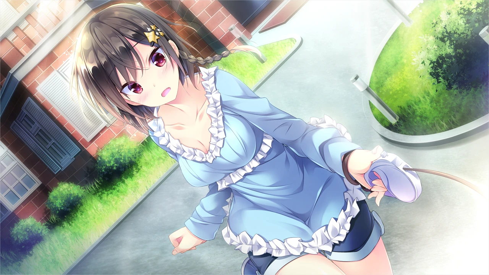
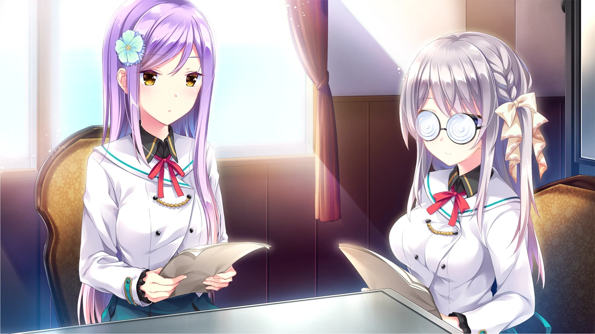
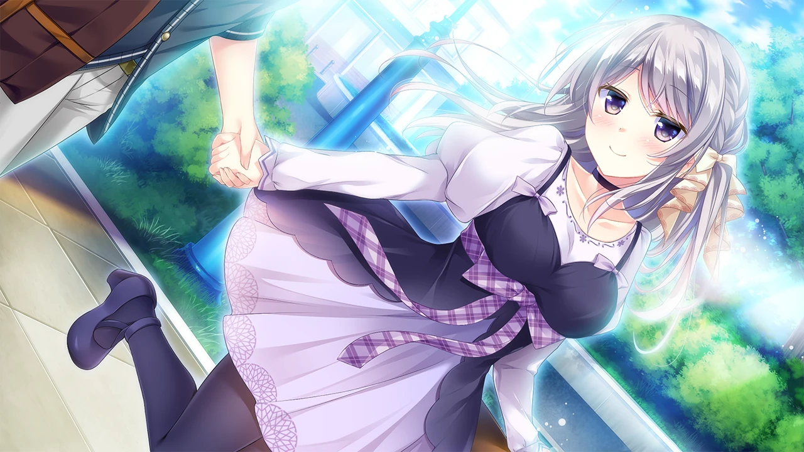
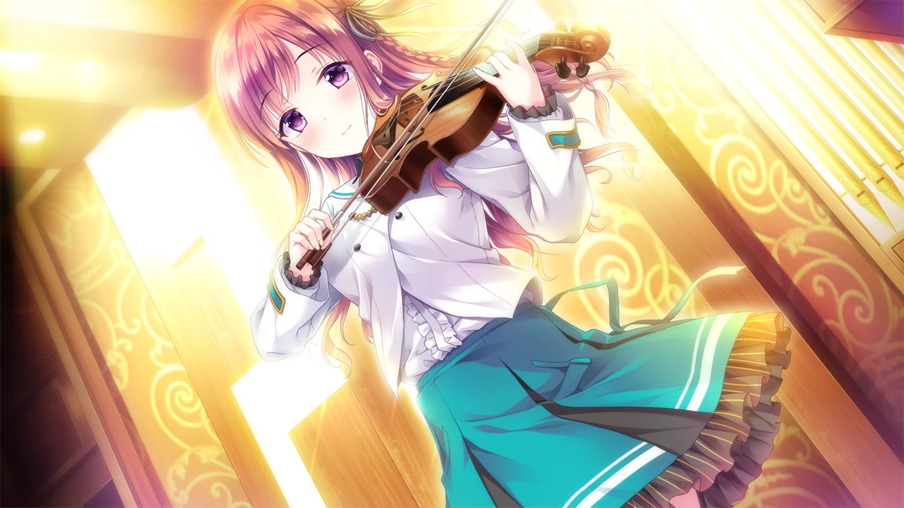

| 資訊一覽     |                 |
| :----------- | :------------------------------------ |
| **開發商**   | ensemble |
| **攻略人數** |   5     |
| **遊戲時長** | 15-20h |
| **類型**     | 女装潜入 治愈       |
| **難度**     |  低  |
| **分級**     | R-18      |
| **遊戲引擎**   |     AdvHD       |


## 故事梗概

男主角女 **雨桜みさき** 在德国进修音乐，這個假期假期乘飞机回国休假．
飞机落地后，他接到姐姐 **雨坂汐里** 打来的电话，
姐姐向男主角委托了一件工作：代替自己在 Lilie 女子学院担任音乐老师一职。

Lilie 学院是一所艺术气息浓厚的大小姐学校，
每年都会举办音乐祭，这是学生们最憧憬的活动。
音乐祭上会选出最优秀的四位选手，在富丽堂皇的大厅里表演四重奏。
可是学校的音乐老师非常短缺，再加上姐姐又怀有身孕，
导致音乐祭的组织陷入了困境。
身为音乐老师的姐姐不想让自己的学生们留有遗憾，而短期内又找不到可靠的人选，
于是她便想到了自己优秀的弟弟。

男主角满口答应下来，于是办理了休学，开始了教书之旅。
不曾想，被姐姐的好友---校保健老师**園谷千春** 连哄带骗套上了女装！
而且得知了一个更惊人的事实，竟然不是单纯的教书，而是 既当老师，也做学生！
就这样，紧张刺激的女装生活正式拉开帷幕。


## 登场人物


<style>
  .charname {
    font-size: 150%;
  }
  .namearea hr {
    margin: 1.5rem 0;
  }
  .sp-character img, .img-shade {
    filter: drop-shadow(0 0 6px #000c);
  }
  .sp-character {
    border-radius: 20px;
    overflow: hidden;
    box-shadow: 0 5px 11px 0 rgb(0 0 0 / 18%), 0 4px 15px 0 rgb(0 0 0 / 15%);

    -webkit-backdrop-filter: blur(1px);
    backdrop-filter: blur(1px);
    
    background-color: var(--chara-card-color);
    
    /* background-color: transparent;
    background-image: var(--this-bg);
    background-position: center;
    background-repeat: no-repeat;
    background-size: cover; */

  }
  .sp-character .char-overlay {
    background-color: var(--chara-card-color);
    min-height: 400px;
    background-image: var(--right-bg);
    background-repeat: no-repeat;
    background-position: top 0px right calc(100% * 0.3 - 130px);
    background-size: auto 480px;

    margin: 0;
    padding: 0;
  }
  :root { /* 配色 */
    --chara-card-color: #ffffffcf;
  }
  [data-user-color-scheme='dark'] {
    --chara-card-color: #1a1a1aa6;
  }
  @media screen and (max-width: 767px) {
    .namearea hr {
      margin: 1rem 0;
    }
    .pc-left {
      -webkit-backdrop-filter: blur(3px);
      backdrop-filter: blur(3px);
      
      background: var(--chara-card-color);
      transition: opacity 0.3s;
    }
    .pc-left.touch {
      opacity: 0.1;
    }
    .sp-character {
     /*background: unset;*/
      /*-webkit-backdrop-filter: unset;
    backdrop-filter: unset;*/
    }
    .sp-character .char-overlay {
      min-height: unset;
      /* background-size: contain;*/
      background-position: top 0px right 0px; 
    }
    :root { /* 配色 */
      --chara-card-color: #ffffff87;
    }
    [data-user-color-scheme='dark'] {
      --chara-card-color: #1a1a1aa6;
    }
  }
</style>


<div class={`row sp-character ${uid}`} style={`--this-bg: url(../image/otomelo/chars/${no}b.webp)`}>
  <div class="col-12 char-overlay row" style={`--right-bg: url(../image/otomelo/chars/${no}.webp)`}>
    <div class="pc-left col-12 col-md-8">
      <div class="namearea col-12 pt-2">
        <div class="charname font-serif font-weight-bold font-italic">
          {name}
        </div>
        <div class="yomi font-italic">
          {yomi}
        </div>
        <hr />
      </div>
      <div class="infoarea col-12" html={html}>
      </div>  
    </div>
  </div>  
</div>


<sp-character no=0 name="雨桜 みさき" yomi="amazakura misaki" uid="misaki">
  <p>
    留德学钢琴的高材生，本作主角。<br>
  </p>
  <p>
    父亲是有名的制琴匠，<br>
    但自幼父母双亡，由姐姐抚养长大，<br>
    所以开头很自然地接受了姐姐的提议。<br>
  </p>
  <p>
    目前在lilie女学院教书&学习。<br>
  </p>
</sp-character>
<br>
<sp-character no=1 name="水澤 沙耶香" yomi="mizusawa sayaka" uid="sayaka">
  <p>
    阳光开朗，善于待人接物的小提琴手。
  </p>
  <p>
    ensemble经典之温柔同桌，<br>
    没事就会来问主角要不要去一起恰饭，要不要一起去花园散步，<br>
    开局更是直接给主角开欢迎会，好感度刷满。<br>
  </p>
</sp-character>
<br>
<sp-character no=2 name="園谷 千夏" yomi="sonoya chika" uid="chika">
  <p>
    元气随和的中提琴手。
  </p>
  <p>
    校保健老师園谷千春的妹妹，（但千夏不知道主角的真实性别）<br>
    跟古灵精怪的姐姐不同，千夏比较老实，认真，礼仪端正，<br>
    非常纯情，有时会此发呆<br>
  </p>
</sp-character>
<br>
<sp-character no=3 name="野々宮 美亜" yomi="nonomiya mia" uid="mia">
  <p>
    有上进心、好胜的傲娇钢琴家。
  </p>
  <p>
    超越傲娇教科书，可入傲娇英灵殿级别的傲娇，<br>
    虽然熟识前她对主角表现出了极强的竞争意识，<br>
    情绪管理也做得很好，但是被夸就会直接破功开始傲娇。<br>
  </p>
</sp-character>
<br>
<sp-character no=4 name="秋山 瑞穂" yomi="akiyama mizuho" uid="mizuho">
  <p>
    温柔大方，娴静稳重的学生会长。
  </p>
  <p>
    人情世故满分，工作能力max，<br>
    非常怕虫子，怕到抱着主角不放，<br>
    也有大胆的一面比如直接亲别人的脖子。<br>
  </p>
</sp-character>
<br>
<sp-character no=5 name="小石川 琴音" yomi="koishikawa kotone" uid="kotone">
  <p>
    知识渊博、善解人意的乐器调律委员。
  </p>
  <p>
    本作人气投票第一，<br>
    说话又好听，又会主动提出帮忙，简直是小天使，<br>
    近视，不带眼镜时她会进入无防备状态，把清纯主角单杀在浴场。<br>
</sp-character>


## 游戏 CG（不含 R-18）













## 给新玩家的推荐理由

如果你也像我一样，厌倦了男主只要亚萨西就能开后宫类型的主流，
不妨来逝逝这款你没有顽过的船新游戏类型：伪娘！

对于像我这种玩过十个甚至九个伪娘作的人来说，
我已经能很轻松地带入并享受這種游戏力。

游戏的大部分时间都是主角 dokidoki 的日常，
没有无聊的无营养对话，毕竟一个不慎暴露就寄了。
然后在最后不得不暴露性别时，就需要拿前面刷够的好感度来打感情牌。

ensemble 还是比较照顾玩家的，没有 bad end，
你只需要选一条喜欢的线就行了。

## 资源和下载

本篇：汉化硬盘版
秒传链接 密码：tmhtmiao.com
```
a169ebe3ed7a7d642a681d40170def63#1c940566bc53caf2bb749547839cb12d#2757089498#有少女献鸣的爱之奏章 2.wim
```
主要内容为后日谈的FD：汉化硬盘版
秒传链接 密码：tmhtmiao.com
```
36b33a7608f0833fa826a6aac14b8f35#538cd6a8dc9bcb57377de049ef1fb899#2117564214#有少女献鸣的爱之奏章 ～愿奏章之上思念满载～.rar
```

<style>
details {
    border: 1px solid #aaa;
    border-radius: 4px;
    padding: .5em .5em 0;
}

summary {
    font-weight: bold;
    margin: -.5em -.5em 0;
    padding: .5em;
}

details[open] {
    padding: .5em;
}

details[open] summary {
    border-bottom: 1px solid #aaa;
    margin-bottom: .5em;
}
</style>

<script>
  //document.documentElement.setAttribute('data-user-color-scheme', 'dark');
  document.addEventListener("DOMContentLoaded", function(){
    let pclefts = document.querySelectorAll('.pc-left');
    pclefts.forEach((el) => {
      el.addEventListener('touchstart', function(){
        el.classList.add('touch');
      })
      el.addEventListener('touchend', function(){
        el.classList.remove('touch');
      })
    });
    //setTimeout(() => document.documentElement.setAttribute('data-user-color-scheme', 'light'), 1000)
  })
</script>
