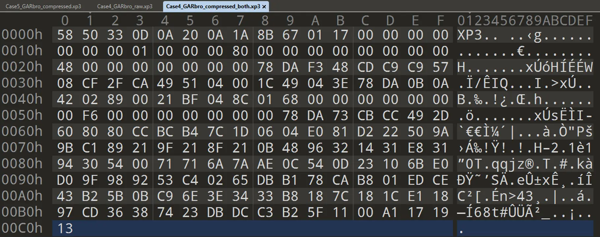
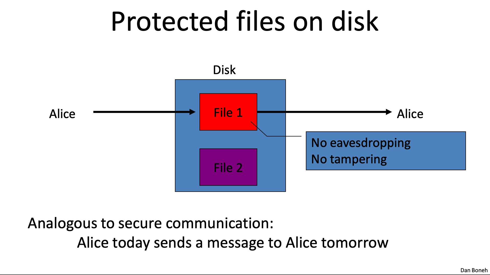

<style>
  :root {
    --my-bg-url: url('');
  }
  body {
    background-image: var(--my-bg-url);
    background-repeat: no-repeat ;
    background-position: left 0px top 75px;
    background-size: 50% auto;
  }
  @media screen and (max-width: 767px) { /* 手機版佈局 */
    body {
      background-image: unset;
      background-repeat: unset ;
      background-position: unset;
      background-size: unset;
    }
  }
  .page-header  {
    background-color: rgba(0,0,0,0.5);
    padding: 3px;
    border-radius: 5px;
  }
  .page-header .mt-1 span.post-meta {
    /* 隱藏嚇人的字數統計 */
    display: none;
  }
  .full-bg-img > .mask {
    background-color: rgba(0,0,0,0) !important;
  }
  :root {
  --color-mode: 'light';
  --body-bg-color: #a5dee4;
  --board-bg-color: rgba(255,255,255,0.8);
  --text-color: #3c4858;
  --sec-text-color: #718096;
  --post-text-color: #2c3e50;
  --post-heading-color: #1a202c;
  --post-link-color: #0366d6;
  --link-hover-color: #30a9de;
  --link-hover-bg-color: #f8f9fa;
  --navbar-bg-color: #3a8fb7;
  --navbar-text-color: #fff;
}
[data-user-color-scheme='dark'] {
  --body-bg-color: #2c4058;
  --board-bg-color: rgba(7, 0, 0, 0.85);
  --text-color: #c4c6c9;
  --sec-text-color: #a7a9ad;
  --post-text-color: #c4c6c9;
  --post-heading-color: #c4c6c9;
  --post-link-color: #1589e9;
  --link-hover-color: #30a9de;
  --link-hover-bg-color: #364151;
  --navbar-bg-color: #3a8fb7;
  --navbar-text-color: #d0d0d0;
}
</style>

<div class="alert alert-success" role="alert">
<b>Contributor：</b><br>
<b>首席研究者：</b>不願意透露姓名的正經大學電腦系畢業前途光明的美少女<br>
<b>助手：</b>辣妹系黑屁<br>
<b>助手：</b>發情系富婆<br>
<b>技術顧問：</b>偶像百合美少女
</div>


| 資訊一覽     |                 |
| :----------- | :------------------------------------ |
| **遊戲引擎** | Kirikiri Z      |

本文是 Uncover XP3 系列的第二篇．如果你是第一次閱讀這個系列，建議先去看看 Uncover XP3 前篇．我們在那邊詳細介紹了 Kirikiri 引擎的 XP3 封包的文件結構，會對你理解本文有幫助．

## 前言

在前篇中，我們詳細介紹了 XP3 文件的內部格式．牠包含了一個文件頭，一個索引區域和一個文件數據區域，這些項目之間由指針連結，因此從文件頭開始，順着指針就可以到達文件的各個部分．


在這篇文章中，我們將進一步深入研究 XP3 文件．於是接下來各章的內容安排如下．

第七章將介紹 XP3 內部的文件壓縮方式和索引壓縮方式；
第八章將首先介紹一些簡單的密碼學基礎知識，然後詳細介紹 Kirikiri 引擎的加解密方式，和牠的插件的代碼實現，最後給出該加密系統的整體概觀；
第九章將使用逆向工程的方法對現實世界的 Kirikiri 遊戲的加密進行簡單分析．但是由於時間倉促，留下了許多懸而未決的問題，這些問題將一併列出．

## Chapter 7. 從非壓縮格式到壓縮格式

在前篇中我們主要對沒有壓縮的 XP3 封包格式進行了分析，本章則將詳細分析 XP3 文件中使用的壓縮方式．

本章的作者是發情系富婆．

### 7.1 緒論

之前我們說道，XP3 包含的每一個文件都有一個對應的索引項來儲存該文件的 Metadata．現在重新將該索引項的結構總結如下圖所示．


可见其中有四个字段与大小有关：

- `entry.UnpackedSize`
- `entry.Size`
- `segment.Size`
- `segment.PackedSize`

在之前的测试中，这些字段都是一样的．这次我们来测试内容压缩的 XP3 文件中，这些信息会有什么变化．

### 7.2 文件內容的壓縮

我们准备了两个简单的纯文本文件用于接下来的测试．


首先使用GARBro分别进行压缩与无压缩打包：


为了对比，使用 BandiZip 分别使用最高等级压缩：


接下来我们使用010 Editor进行文件比较，发现有重合部分，即压缩后数据．


我们根据 [🔗前篇](xp3-research-1.md#53-索引指針) 中探讨的 xp3 结构，得到的压缩后文件内容数据为：

```
0028h  78 DA [F3 48 CD C9 C9 57 08 CF 2F CA 49 51 04 00]  xÚóHÍÉÉW.Ï/ÊIQ.. 
0038h  1C 49 04 3E 78 DA [0B 0A 42 02 89 00] 21 BF 04 8C  .I.>xÚ..B.‰.!¿.Œ
```

我们发现这两段文件相比于 .gz 中的压缩数据，分别在开头多了两个字节，结尾多了四个字节．

其中 `78 DA` 是 zlib 的魔数，表示最大压缩．

后面四个字节是 zlib 添加的 Adler32 校验和，可以看到和 XP3 的 adlr 字段一致．


让我们试试自己用原文件进行校验计算


最後，我们再回来看看索引項中的四个大小字段．


看样子這些大小字段分别存储压缩前后的长度，但两组信息貌似是一样的．

### 7.3 索引區域的壓縮

接下来我们尝试对索引区域也进行压缩．
同时启用内容与索引压缩后：



根据第六章的整体结构结论，可以看到 `01`（索引已压缩）, `0x68`（压缩后索引大小），`0xF6`（压缩前索引大小）和其后 `78 DA` 前缀，压缩后的索引数据．

> 寫個神必小程序解壓文件索引，Voilà

<details>
  <summary>神必小程序</summary>

```python
import zlib
import re

def compress_data(data):
    compressed_data = zlib.compress(data,level=9)
    return compressed_data

def decompress_data(data):
    decompressed_data = zlib.decompress(data)
    return decompressed_data

def pad_text(text, length):
    padded_text = text.ljust(length)
    return padded_text

def format_text(left_text, right_text):

    left_lines = [left_text[i:i + 48] for i in range(0, len(left_text), 48)]
    right_lines = [right_text[i:i + 16] for i in range(0, len(right_text), 16)]

    max_lines = max(len(left_lines), len(right_lines))

    formatted_lines = []

    for i in range(max_lines):
        left_line = left_lines[i] if i < len(left_lines) else ''
        right_line = right_lines[i] if i < len(right_lines) else ''

        left_line = pad_text(left_line, 48)

        line_number = hex(i*16)[2:].zfill(4) + 'h'

        formatted_line = '{:<6s} {:<48s}   {:<16s}'.format(line_number,left_line, right_line)
        formatted_lines.append(formatted_line)

    result = '\n'.join(formatted_lines)
    return result

def process_input(input,option):
    bytes_object = bytes.fromhex(input)
    processed_data = compress_data(bytes_object) if option else decompress_data(bytes_object)
    hex_string_output = ' '.join(['{:02X}'.format(byte) for byte in processed_data])
    printable = processed_data.decode('latin-1',errors='ignore')
    printable = re.sub(r'[\x00-\x1F]', '.', printable)
    print("\n結果為：\n")
    print("       0  1  2  3  4  5  6  7  8  9  A  B  C  D  E  F     0123456789ABCDEF\n")
    formatted_text = format_text(hex_string_output,printable)
    print(formatted_text)
    print("\n==========================================================================\n")
    print("For copy to clipboard:\n")
    print(hex_string_output+"\n\n"+printable)
    print("\n==========================================================================\n")

command = input("1. 壓縮\n2. 解壓\n")

if(command=="1"):
    while True:
        hex_string_input = input("請輸入需要壓縮的十六進制字符串：\n")
        process_input(hex_string_input,True)
elif(command=="2"):
    while True:
        hex_string_input = input("請輸入需要解壓的十六進制字符串：\n")
        process_input(hex_string_input,False)
```

</details>

将文件索引压缩后的数据替换为解压后数据，再与未压缩索引的文件对比：


结果符合第六章我们的结论．

再比较检验和：


`A1 17 19 13`，与前文压缩后数据中 `zlib` 添加的 Adler32 检验和一致．

值得注意的是，Adler32 的校驗和在文件中儲存的字節序有兩種情況，`A1 17 19 13` 是 010editor 的計算結果，暫且把牠當作 `0xA1171913`，然後 `zlib` 在儲存的時候使用的是 `Big Endian`，即從前往後是 `A1 17 19 13` ，而 XP3 在打包時候針對原文件計算的校驗和，儲存在索引項中 `adlr` 字段中的時候是 `Little Endian`，即 `13 19 17 A1`．

### 7.4 小結

本章中我們驗證了文件內容的壓縮算法，牠使用了 zlib 進行最大程度的壓縮，並且 zlib 會在壓縮之後的數據中添加一個 `78 DA` 的頭部和一個 Adler32 校验和的尾部．

同時我們也驗證了索引區域的壓縮也使用了和文件數據壓縮完全一樣的壓縮算法．最後，總結壓縮後的索引區域的結構如下圖：


## Chapter 8. Kirikiri 加密系統

XP3 文件的加密是 Kirikiri 的一個重要功能，是分析 XP3 文件時候的一個繞不開的部分．
雖然有點中二，俺還是想說：

<div class="alert alert-danger" role="alert">
  <span class="alert-heading font-weight-bold font-italic" style="font-size: 130%;">我們要正式開始了</span>
  <p>
    接下來的內容可能會有點抽象，尤其是對於不是電腦系的羣友．我將盡我所能詳細解說，但是如果你還是覺得過於費解的話，你可以看完下面的緒論就放心地跳過——不董這些抽象玩意不會影響到你玩 Galgame！
  </p>
</div>

本章的作者是辣妹系黑屁．

### 8.1 緒論

到上章爲止我們介紹了 XP3 使用的數據壓縮方式．除此之外，krkr 還給 Galgame 公司提供了一個接入加密功能來保護 XP3 數據的機會，那就是本章要介紹的加密功能．

雖然缺少官方的文檔和說明，但是 krkr 的加密是一個內置的功能，但是並不是完全內置，牠以外接加密算法的形式運行，如圖所示：


勘誤：krkr 的加解密不是處理一個連續的文件流，而是處理一個外面遞進來的數據塊．

當需要啓用加密功能時，你需要自己實現一個加密函數和配套的解密函數，然後以某種方式遞給 krkrrel 或者 krkr 引擎．

在 krkr 2 時代，一個比較常見的方法是把你的加密函數和解密函數分別製作成兩個 dll，然後 export 你的函數入口點（🈯️將你的 dll 內部函數暴露出來，供其他程序調用），這樣官方的 XP3 生成器 krkrrel 和 krkr 就都可以調用你寫的代碼了．

就這樣，遊戲公司在發佈遊戲的 XP3 文件時，會使用 krkrrel 對遊戲數據進行打包，而此時 krkrrel 會調用遊戲公司提供的加密插件對數據進行加密．最後遊戲公司在發佈遊戲時，會將配套的解密插件連同遊戲一起發佈給玩家．玩家在遊玩的時候，krkr 會調用遊戲公司提供的解密插件完成對遊戲數據的解密和讀取．

關於如何實現這麼一組插件 dll，我將在下面的 8.3 小節詳細說明．
這裏先列出一個參考文獻，牠對如何開發 krkr 的加解密插件進行了介紹．你可以先不用看．

> 🔗吉里吉里/KAGでのデータ暗号化方法例
> http://keepcreating.g2.xrea.com/DojinDOC/HowToCode.html

### 8.2 密碼學背景

不過在開始談加解密插件的實現之前，我想先介紹一些密碼學裏面的基礎知識，希望能幫助羣友理解後文的內容．

<br>

<span class="alert-heading font-weight-bold text-danger" style="font-size: 110%;">👒 密碼和密鑰有什麼區別？</span>

密碼（Password）和密鑰（Key，注意不要唸作密匙，，，）是兩個容易混淆的概念．你平時在各種網站上或者連 Wi-Fi 的時候輸入的密碼，像什麼 123456，password，你的手機號或者前女友的生日，其實都是「口令」，是一個只有你才知道的暗號，牠並不直接參與加密的運算．

你的密碼可能長下面這樣：

```
123456
password
13065778103
19980721
...
```

而密鑰是一串數據（字節），並且直接參與加解密的**數學運算**．密鑰並不能直接打印或者寫出來，妳也不需要去牢記牠，因爲有一些算法可以幫你用密碼來生成密鑰，這樣你就可以用密碼來加密你的文件了．

你的密鑰用二進制查看器可能是長這樣的（假設長度是 16 個 byte）：

```
       0  1  2  3  4  5  6  7  8  9  A  B  C  D  E  F   ASCII
0000h  29 6B D6 EB 2C A9 03 21 BB EF 5F 5F 4C FC 10 EC  )kÖë,©.!»ï__Lü.ì 
這個部分是密鑰↗️
```

下文的加解密需要我們直接和密鑰打交道．最後再次提醒，不要用手機號和前女友的生日來做密碼，因爲知道這些的不只是你一個人...！

<br>

<span class="alert-heading font-weight-bold text-danger" style="font-size: 110%;">👒 什麼是異或（XOR）？</span>

異或（又稱爲 XOR，Exclusive OR 或者互斥或）是一個運算符，牠的符號是 ⊕．
簡單地說，牠的功能就是找不同．如果我把一個 bit 的 1 和 0 輸入 XOR，那麼就會得到下面的結果：

<div>Table 8.2 異或真值表</div>

| 第一個輸入 | 第二個輸入 | 輸出 | 真假？ |
| --- | --- | --- | --- | 
| 0 | 0 | 0 | 假 |
| 0 | 1 | 1 | 真 |
| 1 | 0 | 1 | 真 | 
| 1 | 1 | 0 | 假 | 

可以看到，當兩個輸入不一樣的時候，XOR 纔會輸出 真，因此本質上就是找不同．

讓我們 XOR 一下 byte（也就是 8 個 bit）：

```
      10110100
XOR   00101101 
---------------
  =   10011001
```

可以看到，當上下的兩個 byte 的位不同的時候，輸出結果纔是 1．因此對更長的內容計算 XOR 的時候，本質上就是對各個 bit 進行逐個 XOR．

現在我們對圖像進行 XOR 運算．畫布上白色的像素代表 0，黑色的像素代表 1．
下圖中，A 和 B 是原圖像，C 是 XOR 的輸出結果．可見 A 和 B 相同的部分（尤其是黑色的實線正方形邊框）經過 XOR 後在 C 中已經归零．


從圖中我們還能發現，連續進行兩次相同的 XOR 運算，即 A ⊕ B ⊕ B，會得到原數據 A．利用這個性質，我們可以設計一個簡單的加密．

首先原數據是 A，加密密鑰是 B，經過 A ⊕ B 的計算即可得到密文 C．
解密時，計算 C ⊕ B 即可得到原文 A．

最後，放一個動畫來幫助第一次聽說 XOR 的羣友加深印象．

<video class='mb-3' playsinline="" autoplay="" muted="" loop="" width='100%'>
    <source src="https://s3static-zone0.galgamer.eu.org/video-2d35/xp3-2/xor1.mp4" type="video/mp4">
</video>
<p class="image-caption">Fig 8.2.2 使用 XOR 進行加解密</p>

你可能會問爲什麼我要在一開始就介紹 XOR 的概念，那是因爲 XOR 實在是過於重要，牠在各種加解密算法中被大量使用．包括各個 Galgame 廠商自己實現的加密算法，這些算法的前半部分可能在幹各種各樣的事情，但是最後一步多少都是在通過 XOR 進行加密或者解密．

<br>

<span class="alert-heading font-weight-bold text-danger" style="font-size: 110%;">👒 對稱加密法</span>

接下來要介紹的是對稱加密．簡單地來說牠使用相同的密鑰來加密和解密，如圖所示：


有人可能就要說了，這不是廢話嗎？沒有一樣的密鑰還能解密❓確實，在對稱加密的世界加密和解密需要同一個密鑰，但是還有一種非對稱加密，這種加密需要兩個密鑰，用其中一個進行加密之後，用另外一個才能解密．由於本文中針對 XP3 數據的加密都是對稱加密，所以非對稱的部分先略過．有興趣的羣友可以自己去看看維基百科．

<br>

<span class="alert-heading font-weight-bold text-danger" style="font-size: 110%;">👒 爲什麼需要加密？</span>

有了對稱加密法之後，我們再來思考一下加密的目的是什麼．從蕞一般的場景來說，加密的目的是爲了保證通信的安全，確保數據不被竊聽或者篡改．比如大家都非常熟悉的 HTTPS，牠保護了用戶上網的流量不被竊聽，如下圖：


> 容我盜竊一張斯坦福的 Cryptography I 課程的 PPT

但是在 krkr 的世界中並不需要進行通信，那麼加密的目的或者說加密的意義在哪裏呢？設想一下，現在屏幕前的妳加密自己的文件的目的是什麼？是不是想要防止別人偷看和篡改？於是這種情況就成了「現在的妳」想要和「未來的妳」進行通信，並且防止通信內容（色圖）遭到泄漏和篡改，如圖：



> 容我再盜竊一張

此時再回到 krkr 就不難理解牠們進行加密的目的是什麼了．**遊戲公司想要和未來購買遊戲的玩家的電腦中的 krkr 進行安全通信，防止遊戲數據被泄露或者篡改**，說白了就是防止玩家提取遊戲中的數據．然而要達到這一點，光有加密和密碼學技術是不夠的，不然現在 E-Hentai 裏面也不會各種遊戲 CG 滿天飛了．

草，感覺這一小節講了一個衆所周知而且很顯而易見的事情，請原諒我的廢話，，，

<br>

<span class="alert-heading font-weight-bold text-danger" style="font-size: 110%;">👒 流式加密</span>

上面鋪墊了半天，終於到了我真正想講的重點了，希望妳還記得對稱加密是什麼．

對稱加密可以分為兩種類型：流式加密和塊式加密．
我們關心的是流式加密．流指的是一串很長很長的字節流．想象把一個文件拉成長長的一串字節，然後字節可以繼續拉開成 bit，如下圖所示．

<video class='mb-3' playsinline="" autoplay="" muted="" loop="" width='100%'>
    <source src="https://s3static-zone0.galgamer.eu.org/video-2d35/xp3-2/filecontent2.mp4" type="video/mp4">
</video>
<p class="image-caption">Fig 8.2.6 文件可以看作字節流</p>


然後再使用「密鑰流生成函數」，這個函數吸收一個密鑰，然後產生無限長的密钥流．這個密钥流也是一串字節．並且具有無限的長度．
簡單地說，只要知道了密鑰，就可以生成那個唯一的密钥流．如同高中數學中的數列一樣，給定一個確定的生成規律，你就可以無限地往後遞推；或者直接給定一個通項公式，你就可以求出數列中的任意一位，如下圖所示．

<video class='mb-3' playsinline="" autoplay="" muted="" loop="" width='100%'>
    <source src="https://s3static-zone0.galgamer.eu.org/video-2d35/xp3-2/genstream.mp4" type="video/mp4">
</video>
<p class="image-caption">Fig 8.2.7 生成函數產生密鑰流</p>

最後，將密鑰流和需要加密的原文件進行逐個 bit 的 XOR，完成加密，如圖．

<video class='mb-3' playsinline="" autoplay="" muted="" loop="" width='100%'>
    <source src="https://s3static-zone0.galgamer.eu.org/video-2d35/xp3-2/xorenc.mp4" type="video/mp4">
</video>
<p class="image-caption">Fig 8.2.8 流式加密過程</p>

看到這裏你可能會匪夷所思，爲什麼這麼一個簡單的 XOR 也可以達到加密的效果．爲了說明這一點，讓我們再觀察一下表 8.2．

<div>Table 8.2 異或真值表</div>

| 第一個輸入 | 第二個輸入 | 輸出 | 真假？ |
| --- | --- | --- | --- | 
| 0 | 0 | 0 | 假 |
| 0 | 1 | 1 | 真 |
| 1 | 0 | 1 | 真 | 
| 1 | 1 | 0 | 假 | 

假設第一個輸入是原文，第二個輸入是密鑰流，輸出是加密後的數據．現在我們拿到了加密後的數據，無論牠是 0 還是 1，對應的原文都有 0 或者 1 兩種可能．如果我們不知道密鑰流對應的位是 0 還是 1，那麼將無法猜測原文到底是 0 還是 1，因爲牠們各佔 50% 的可能性．

解密時，根據上面介紹的雙重 XOR 恢復原文的性質，只需要把密文和密鑰流再進行一下 XOR，就可以拿到原文了． 

> 這裏的示例來自 chacha20 流式加密算法，牠簡單高效而且常用．
> 我使用的密鑰事
> ```ascii
> 00 01 02 03 04 05 06 07 08 09 0A 0B 0C 0D 0E 0F
> 10 11 12 13 14 15 16 17 18 19 1A 1B 1C 1D 1E 1F
> ```
> 我使用的 nonce（一次性序列）事
> ```ascii
> AA AA AA AA AA AA AA AA AA AA AA AA
> ```
> 通過調整 chacha20 的計數器，可以一瞬 seek 到密鑰流的任意位置，意思是牠事有「通項公式」的．這裏把計數器初始化爲 0.
> 上面這些只是我的示例！Galgame 公司也不一定使用 chacha20 進行加密，妳要是不董 chacha20 也不影響妳繼續閱讀本文．

最後再來思考一下，如果要從把文件的正中間——比如說從第 1000 個字節開始到 1200 個字節爲止——進行解密，要怎麼做．
可以把步驟列出來如下：

 - **來到文件流的第 1000 個字節**（fancy 一點的說法是：seek 到文件流的第 1000 個的位置）
 - **seek 到密鑰流的第 1000 個的位置**
 - **把上面兩個流開 XOR！直到第 1200 個字節爲止**

一步一步第來看，首先我們要 seek 文件，這很簡單，因爲告訴硬盤往後轉個 1000 個字節就完事了．但是要 seek 密鑰流就沒那麼簡單了，因爲密鑰流是生成函數生成的，並且具有無限的長度（你可以理解成無窮項的數列）．當然，如果這個生成函數有通項公式，那麼就可以一瞬計算出第 1000 項是什麼；但是如果不幸這個函數沒有通項公式的話，你就必須要從頭開始往後遞推了．

> 數學 nerd 不要欺負我，我指的是沒有初等函數形式的通項公式．

如果是那種不幸的情況，步驟就要變成下面這樣了：

 - **seek 到文件流的第 1000 個的位置**
 - **這密鑰流沒有「通項公式」沒法 seek 啊**．只能從頭開始往後遞推計算，直到第 1000 項．
 - **把上面兩個流開 XOR！直到第 1200 個字節爲止**

於是密鑰流生成函數的好壞直接關係到加密算法的好壞，好的生成函數可以直接 seek 節省不必要的運算，並且更加難以破解．

然而，世界上有一些加密算法，牠們在解密的時候，不僅需要使用密鑰流進行 XOR，**並且還需要知道前一塊數據的內容**，如圖所示：


這種解密下一塊數據要依賴上一塊數據的加密算法，會使得文件不能直接從中間開始解密，有的時候甚至必須要從頭開始運算．

------

還有另外一種塊式加密，牠是把原文切割成相等大小的小塊分別加密，這裏就不多介紹了．

密碼學是一門很有趣的學科，如果你有興趣，可以去看一下斯坦福的 Cryptography I 公開課．

> 🔗Cryptography I Course (Stanford) | Coursera
> https://www.coursera.org/learn/crypto
> 

我只看了一點沒看完，麻煩羣友學完了教我，嚶嚶，，，

### 8.3 加解密插件的實現

### 8.4 Kirikiri 引擎的文件讀取邏輯

### 8.5 解密系統的全景圖

### 8.6 小結


## Chapter 9. 現實世界中的逆向工程分析

### 9.1 再回顧：解密部分邏輯中的數據結構

### 9.2 基於 Kirikiri 2 的解密插件的簡單分析

### 9.3 基於 Kirikiri Z 的嵌入式解密

### 9.4 尚未解決的問題


## 總結
